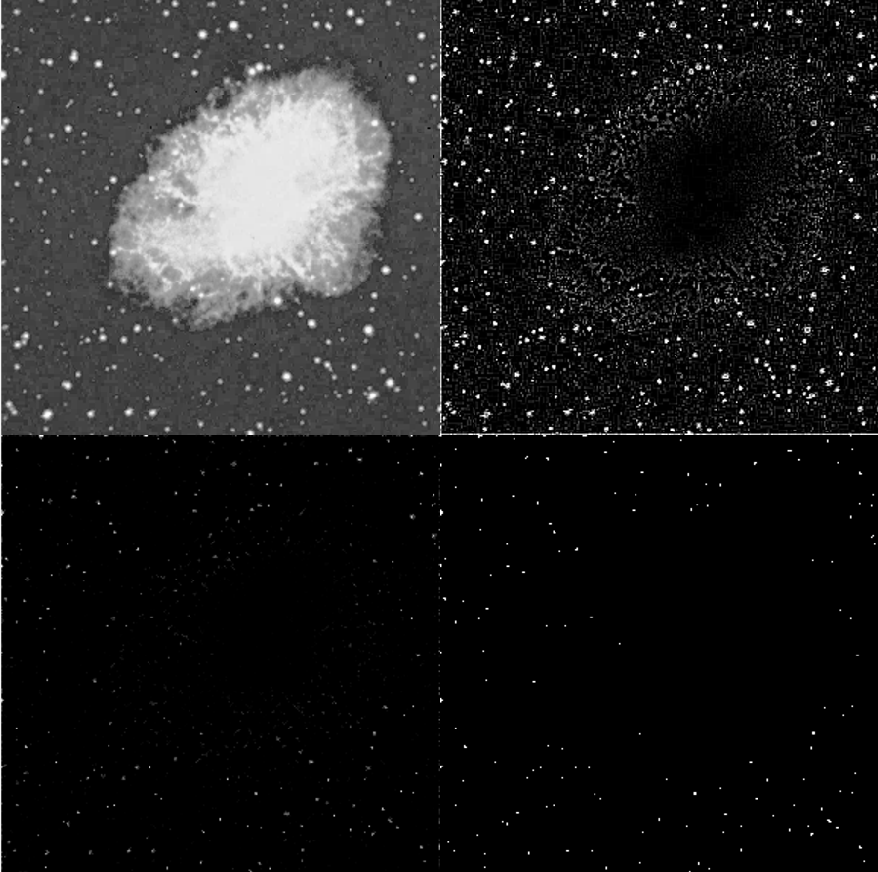

## Task 1: Point Detection — Crab Nebula Star Isolation

### Objective
The goal of this task is to isolate the surrounding stars in an image of the Crab Nebula (`crabpulsar.tif`) by removing the dominant nebular region using a point detection filter combined with morphological processing.


### Result




### Analysis

**Top-left — Original Image (`f`)**

The original grayscale image shows the Crab Nebula, with a large diffuse bright region in the centre representing the nebula, and a number of small isolated bright points (stars) scattered around it.

**Top-right — After Point Detection Filter (`g1`)**

A Laplacian point detection kernel was applied (centre weight +8, surrounding weights -1). 

```matlab
w = [-1 -1 -1;
     -1  8 -1;
     -1 -1 -1]
```

This filter strongly responds to pixels that are significantly brighter than their neighbours. As a result, isolated stars appear as bright white dots, while the nebula — being a large, gradually varying bright region — produces a low response and appears dark. The `abs()` function ensures all values remain positive.

**Bottom-left — After Erosion (`g2`)**

Morphological erosion was applied using a disk-shaped structuring element of radius 1. This removes small noise pixels that were falsely detected, retaining only the more prominent and reliable star detections. The image becomes darker with fewer but more accurate points remaining.

**Bottom-right — After Thresholding (`g3`)**

A threshold of 100 was applied to binarise the image. Pixels with a response value ≥ 100 are set to white (255), and all others to black (0). The final binary image shows the nebula almost entirely removed, with the surrounding stars clearly highlighted as white dots against a black background.


### Conclusion

The combination of a Laplacian point detection filter, morphological erosion, and thresholding successfully isolates the surrounding stars from the Crab Nebula image. The filter responds strongly to isolated bright points (stars) but weakly to large uniform bright regions (the nebula), making it effective for this type of feature extraction. The choice of threshold is important — too high would miss faint stars, while too low would retain unwanted noise.
