## Task 1: Point Detection — Crab Nebula Star Isolation

### Objective
The goal of this task is to isolate the surrounding stars in an image of the Crab Nebula (`crabpulsar.tif`) by removing the dominant nebular region using a point detection filter combined with morphological processing.


### Code
```matlab
clear all
close all
f = imread('assets/crabpulsar.tif');
w = [-1 -1 -1;
     -1  8 -1;
     -1 -1 -1];
g1 = abs(imfilter(f, w));      % point detected
se = strel("disk", 1);
g2 = imerode(g1, se);          % eroded
threshold = 100;
g3 = uint8((g2 >= threshold)*255); % thresholded
montage({f, g1, g2, g3});
```


### Result


### Analysis

**Top-left — Original Image (`f`)**

The original grayscale image shows the Crab Nebula, with a large diffuse bright region in the centre representing the nebula, and a number of small isolated bright points (stars) scattered around it.

**Top-right — After Point Detection Filter (`g1`)**

A Laplacian point detection kernel was applied:
```matlab
w = [-1 -1 -1;
     -1  8 -1;
     -1 -1 -1]
```

This filter strongly responds to pixels that are significantly brighter than their neighbours. Isolated stars appear as bright white dots, while the nebula produces a low response and appears dark. The `abs()` function ensures all values remain positive.

**Bottom-left — After Erosion (`g2`)**

Morphological erosion was applied using a disk-shaped structuring element of radius 1. This removes small noise pixels that were falsely detected, retaining only the more prominent and reliable star detections.

**Bottom-right — After Thresholding (`g3`)**

A threshold of 100 was applied to binarise the image. Pixels with a response value ≥ 100 are set to white (255), and all others to black (0). The nebula is almost entirely removed, with surrounding stars clearly highlighted as white dots.


### Conclusion

The combination of a Laplacian point detection filter, morphological erosion, and thresholding successfully isolates the surrounding stars from the Crab Nebula image. The filter responds strongly to isolated bright points but weakly to large uniform bright regions, making it effective for this type of feature extraction.


### What I Learnt & Reflections

- The Laplacian kernel detects isolated bright points by computing the difference between a pixel and its surroundings — effective for stars but not for diffuse regions like nebulae.
- Morphological erosion is a useful post-processing step to remove noise after filtering.
- Threshold selection involves a trade-off: too high misses faint stars, too low retains noise.
- This task showed how combining simple operations (filtering → erosion → thresholding) can produce meaningful results in astronomical image analysis.


## Task 2: Edge Detection

### Objective
The goal of this task is to apply three edge detection methods — Sobel, LoG (Laplacian of Gaussian), and Canny — to two images: a chip micrograph (`circuits.tif`) and a brain MRI scan (`brain_tumor.jpg`). The task also involves tuning the threshold parameters to achieve the best possible edge detection results.


### Code
```matlab
clear all
close all

f1 = imread('assets/circuits.tif');
f2 = imread('assets/brain_tumor.jpg');

if size(f2, 3) == 3
    f2 = rgb2gray(f2);
end

%% circuits.tif - default thresholds
[g1_sobel, t1_sobel] = edge(f1, 'Sobel');
[g1_log, t1_log]     = edge(f1, 'log');
[g1_canny, t1_canny] = edge(f1, 'Canny');

figure;
montage({f1, g1_sobel, g1_log, g1_canny});
title('circuits.tif: Original | Sobel | LoG | Canny');

%% brain_tumor.jpg - default thresholds
[g2_sobel, t2_sobel] = edge(f2, 'Sobel');
[g2_log, t2_log]     = edge(f2, 'log');
[g2_canny, t2_canny] = edge(f2, 'Canny');

figure;
montage({f2, g2_sobel, g2_log, g2_canny});
title('brain_tumor.jpg: Original | Sobel | LoG | Canny');

%% circuits.tif - tuned thresholds
g1_sobel_tuned = edge(f1, 'Sobel', 0.05);
g1_log_tuned   = edge(f1, 'log', 0.003);
g1_canny_tuned = edge(f1, 'Canny', [0.05 0.15]);

figure;
montage({g1_sobel_tuned, g1_log_tuned, g1_canny_tuned});
title('circuits.tif Tuned: Sobel | LoG | Canny');

%% brain_tumor.jpg - tuned thresholds
g2_sobel_tuned = edge(f2, 'Sobel', 0.02);
g2_log_tuned   = edge(f2, 'log', 0.001);
g2_canny_tuned = edge(f2, 'Canny', [0.03 0.1]);

figure;
montage({g2_sobel_tuned, g2_log_tuned, g2_canny_tuned});
title('brain_tumor.jpg Tuned: Sobel | LoG | Canny');
```


### Results

**Figure 1 — circuits.tif: Default Thresholds**

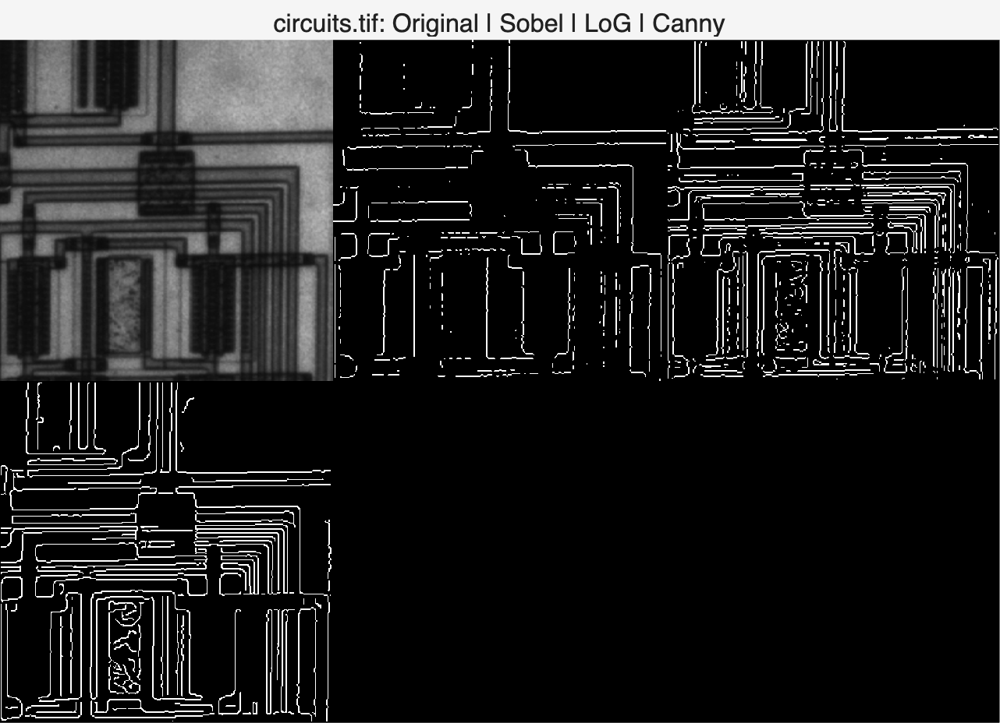

**Figure 2 — brain_tumor.jpg: Default Thresholds**

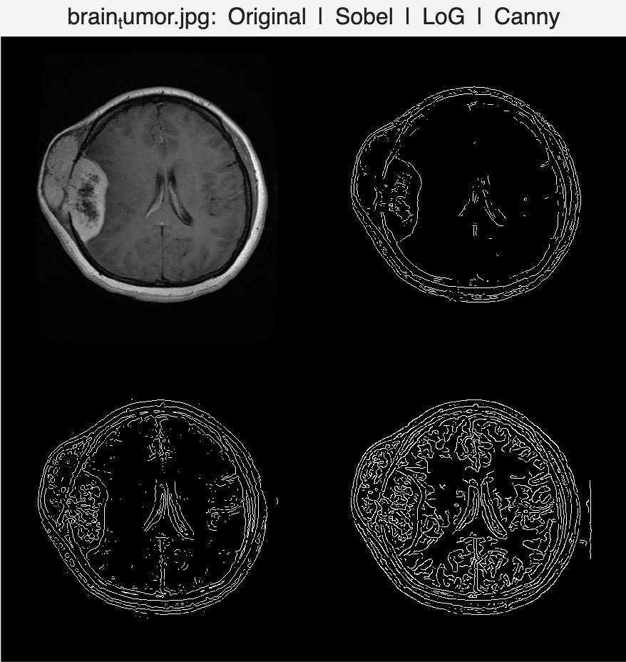

**Figure 3 — circuits.tif: Tuned Thresholds**

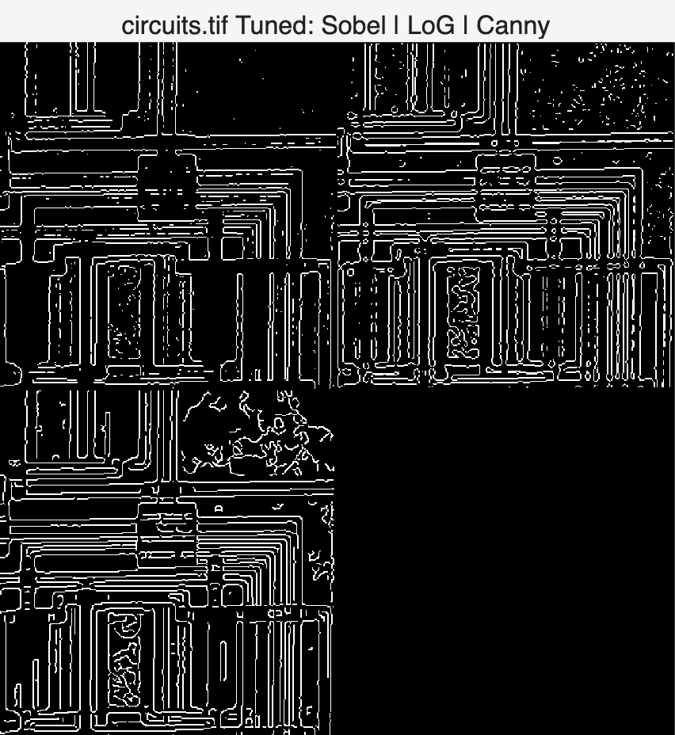

**Figure 4 — brain_tumor.jpg: Tuned Thresholds**

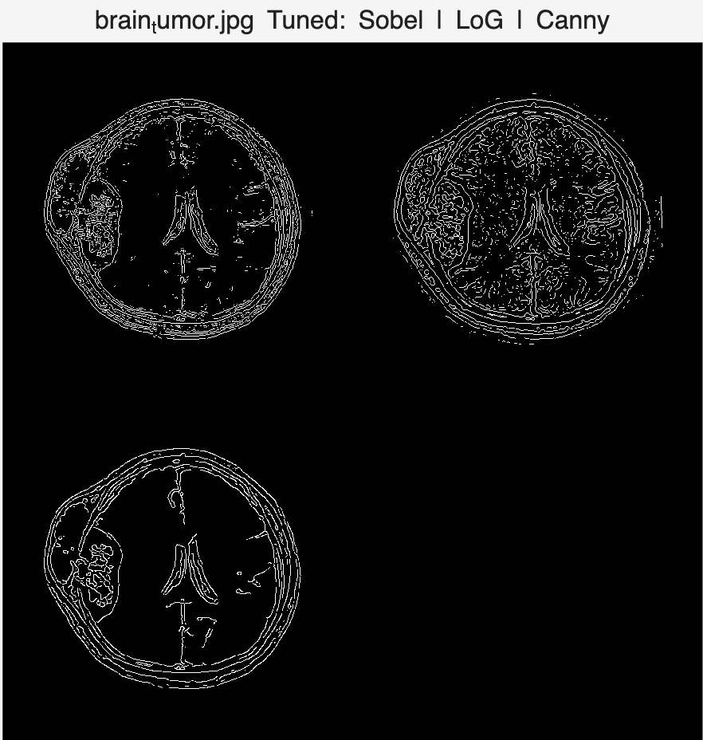


### Analysis

#### circuits.tif

**Top-left — Original Image**
A grayscale micrograph of an integrated circuit, featuring sharp geometric structures, straight lines, and high-contrast boundaries between components.

**Top-right — Sobel (default)**
The Sobel method detects edges by approximating image gradients. It successfully captures the major circuit boundaries and straight lines, producing clean and well-defined edges.

**Bottom-left — LoG (default)**
The Laplacian of Gaussian method first smooths the image with a Gaussian filter before applying the Laplacian. The result shows slightly thicker edges compared to Sobel, and also detects some finer internal structures within the circuit components.

**Bottom-right — Canny (default)**
The Canny method uses local gradient maxima with hysteresis thresholding. It produces the thinnest and most precise edges among the three methods, clearly capturing fine circuit details while suppressing noise effectively.

#### brain_tumor.jpg

**Top-left — Original Image**
A grayscale MRI scan showing a cross-section of a patient's brain. A bright region in the upper-left area indicates the tumour.

**Top-right — Sobel (default)**
Sobel detects the main structural boundaries of the brain, including the outer skull boundary and some internal tissue boundaries. However, finer internal details are less well captured.

**Bottom-left — LoG (default)**
LoG produces more detailed edge maps with closed contours, revealing more internal brain structures. The tumour region boundary is also visible.

**Bottom-right — Canny (default)**
Canny produces the most detailed result, capturing a large number of internal brain structures and clearly highlighting both the outer boundary and internal tissue transitions, including the tumour region.


### Threshold Tuning

After testing different threshold values, the tuned results show the following improvements:

- **circuits.tif**: Lowering the Sobel and LoG thresholds reveals more circuit detail. The Canny method with `[0.05 0.15]` provides a good balance between detail and noise suppression.
- **brain_tumor.jpg**: Lower thresholds for all three methods reveal more internal brain structures. The tuned Canny result with `[0.03 0.1]` captures the most anatomical detail, though it also picks up more noise.


### Conclusion

All three methods successfully detect edges in both images, but with different characteristics. Sobel is fast and simple but can miss fine details. LoG produces closed contours and is good for detecting blobs and boundaries. Canny generally gives the best results — thin, precise edges with good noise resistance — making it the most suitable method for detailed images like MRI scans and circuit micrographs.


### What I Learnt & Reflections

- Different edge detection methods suit different types of images — Canny performed best overall, but all three have valid use cases.
- Threshold selection significantly affects the output: lower thresholds detect more edges but also introduce noise.
- For Canny, using a two-value threshold `[low high]` allows finer control over which edges are preserved.
- In medical imaging (e.g. MRI), edge detection could help highlight anatomical boundaries, though careful tuning is needed to avoid false detections.

## Task 3: Hough Transform for Line Detection

### Objective
Use the Hough Transform to detect straight line segments in a rotated circuit image (`circuit_rotated.tif`). The pipeline consists of four steps: (1) detect edge points using Canny, (2) map those edge points into Hough space, (3) find prominent peaks in the accumulator, and (4) use `houghlines` to draw the detected line segments back on the original image.


### Code
```matlab
clear all; close all; clc;

%% Step 1: Read image and find edge points
f = imread('assets/circuit_rotated.tif');
fEdge = edge(f, 'Canny');
figure(1);
montage({f, fEdge});
title('Original vs Canny edge');

%% Step 2: Hough Transform and display accumulator
[H, theta, rho] = hough(fEdge);
figure(2);
imshow(H, [], 'XData', theta, 'YData', rho, ...
       'InitialMagnification', 'fit');
xlabel('\theta (degrees)');
ylabel('\rho (pixels)');
title('Hough Transform accumulator');
axis on; axis normal; hold on;

%% Step 3: Find peaks in Hough space and overlay on H
numPeaks = 5;
peaks = houghpeaks(H, numPeaks);
x = theta(peaks(:,2));
y = rho(peaks(:,1));
plot(x, y, 'o', 'Color', 'red', ...
     'MarkerSize', 10, 'LineWidth', 1);

%% Step 4: Visualise Hough space as 3D surface
figure(3);
surf(theta, rho, H);
xlabel('\theta (degrees)', 'FontSize', 12);
ylabel('\rho (pixels)', 'FontSize', 12);
zlabel('Hough counts', 'FontSize', 12);
title('Hough Transform (3D surface)');
shading interp;
colormap hot;
colorbar;

%% Step 5: Use houghlines to detect and draw line segments
lines = houghlines(fEdge, theta, rho, peaks, ...
                   'FillGap', 5, 'MinLength', 7);
figure(4);
imshow(f); hold on;
title('Detected line segments using Hough transform');
max_len = 0;
for k = 1:length(lines)
    xy = [lines(k).point1; lines(k).point2];
    plot(xy(:,1), xy(:,2), 'LineWidth', 2, 'Color', 'green');
    plot(xy(1,1), xy(1,2), 'x', 'LineWidth', 2, 'Color', 'yellow');
    plot(xy(2,1), xy(2,2), 'x', 'LineWidth', 2, 'Color', 'red');
    len = norm(lines(k).point1 - lines(k).point2);
    if len > max_len
        max_len = len;
        longest_xy = xy;
    end
end
if exist('longest_xy', 'var')
    plot(longest_xy(:,1), longest_xy(:,2), 'LineWidth', 2, 'Color', 'cyan');
end
```


### Results & Analysis

**Figure 1 — Original vs Canny Edge**

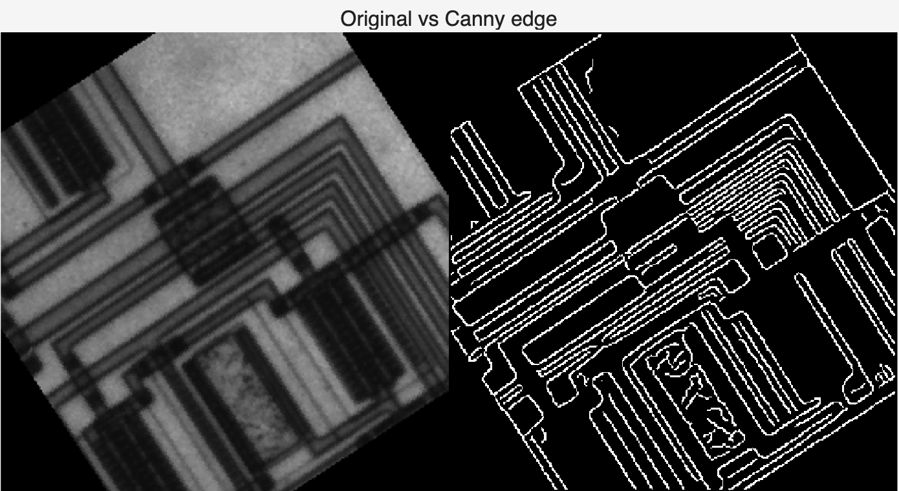

The Canny result highlights the strongest boundaries in the rotated circuit image. These edge pixels serve as the input to the Hough Transform, since straight lines in the image produce consistent votes in Hough space.

**Figure 2 — Hough Transform Accumulator with Peaks**

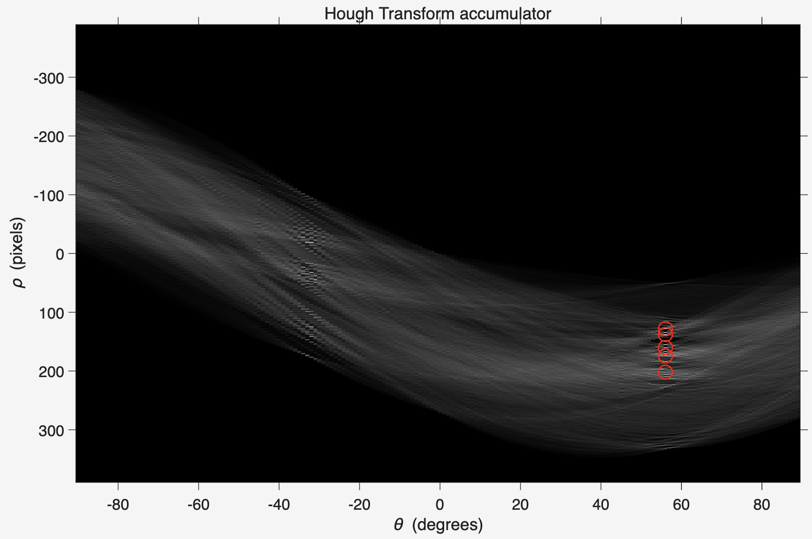

In the accumulator plot, the dominant structure appears as a curved or elongated ridge, where many combinations of θ and ρ receive votes. The red peak markers correspond to the strongest parameter bins, meaning there are many edge pixels aligned along particular straight-line directions.

**Figure 3 — Hough Transform 3D Surface**

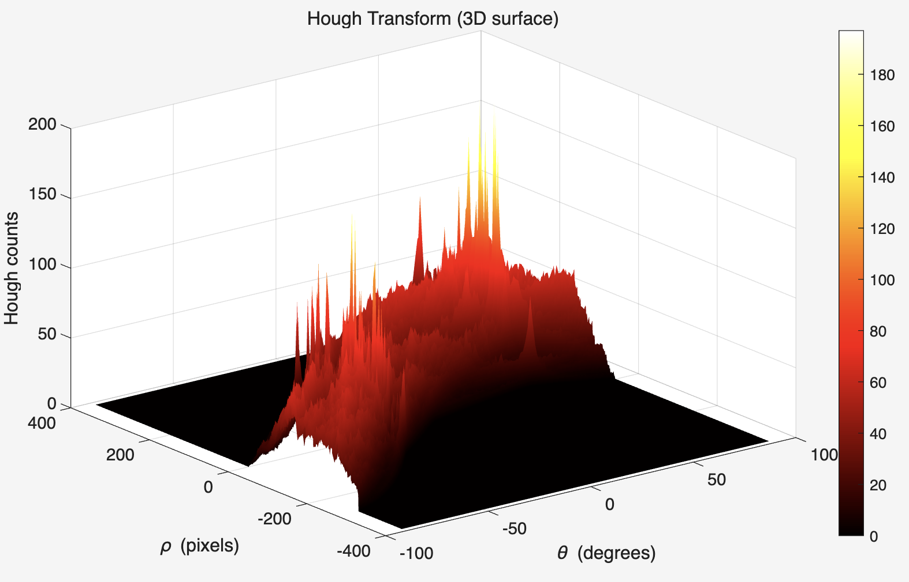

The 3D surface view makes the accumulator peaks clearer. High "mountain" regions correspond to strong line evidence. The surface shows multiple elevated areas, indicating the circuit contains several line segments and possibly multiple near-parallel lines that generate comparable votes.

**Figure 4 — Detected Line Segments on Original Image**

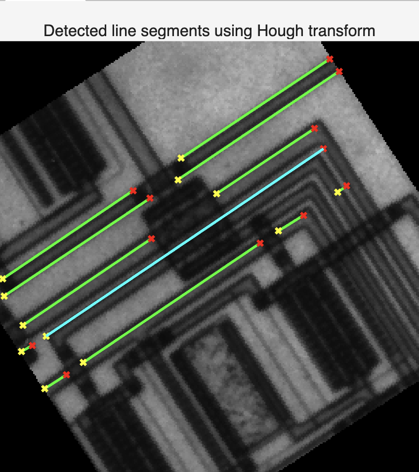

`houghlines` draws multiple green line segments across the circuit layout. The number of detected segments is `length(lines) = 12`, which is not equal to `numPeaks = 5`, for the following reasons:

- A single Hough peak bin may correspond to more than one physical line segment in the image.
- Edge points on the same ideal line can be fragmented into several shorter segments; `FillGap` and `MinLength` control whether nearby fragments are merged or discarded.
- The circuit contains repeated parallel traces and right-angle patterns, which can create several strong local maxima or produce multiple valid segments around the same parameter peak.

The longest detected segment is highlighted in cyan.


### Conclusion

The Hough Transform pipeline successfully detected straight-line structures in the rotated circuit image. Canny extracted reliable edge points, and the Hough accumulator concentrated the evidence of lines into strong parameter regions. Using `houghpeaks` and `houghlines`, the algorithm returned line segments that match the circuit traces, demonstrating that the Hough Transform is effective for detecting global linear patterns even when the image is rotated. 

To detect more lines and potentially additional directions, I tuned `numPeaks` in `houghpeaks`. Increasing `numPeaks` from 5 to 8 allowed more strong $(\theta, \rho)$ bins to be selected, which led to a larger set of line segments by `houghlines` (`length(lines)` grew from 12 to 24). If further improvement is needed, additional parameters to try are `FillGap` and `MinLength` in `houghlines`, as well as the Canny edge sensitivity, since edge continuity strongly affects how many line segments can be extracted.


### What I Learnt & Reflections

- The Hough Transform works by converting each edge point into a sinusoidal curve in (θ, ρ) space — where multiple curves intersecting at the same point indicate a common straight line.
- `houghpeaks` finds the strongest bins in the accumulator, but a single peak can correspond to multiple physical line segments in the image.
- Parameters like `FillGap` and `MinLength` in `houghlines` are important for controlling output quality — small gaps between fragments can be bridged, and very short segments can be filtered out.
- The 3D surface plot was a helpful way to visualise the accumulator and understand why multiple peaks emerge from a structured image like a circuit.

## Task 4: Segmentation by Thresholding

### Objective
The goal of this task is to segment yeast cells from the background in `yeast_cells.tif` using Otsu's method, explore its limitations when cells are touching, and apply Watershed segmentation as an alternative method to separate touching cells.


### Code
```matlab
clear all; close all; clc;

%% Step 1: Read image
f = imread('assets/yeast_cells.tif');
figure(1);
imshow(f);
title('Original Image');

%% Step 2: Otsu's method - global thresholding
T = graythresh(f);
g_otsu = imbinarize(f, T);
figure(2);
montage({f, g_otsu});
title(sprintf('Original | Otsu Segmentation (T = %.3f)', T));

%% Step 3: Show limitation - touching cells are merged
g_otsu_inv = ~g_otsu;
cc = bwconncomp(g_otsu_inv);
fprintf('Number of detected regions (Otsu): %d\n', cc.NumObjects);

%% Step 4: Watershed segmentation
g_bin = ~g_otsu;
D = bwdist(~g_bin);
D = -D;
D(~g_bin) = Inf;
L = watershed(D);
g_bin(L == 0) = 0;

figure(3);
montage({f, g_otsu, g_bin});
title('Original | Otsu | Watershed Segmentation');

%% Step 5: Overlay watershed result on original
figure(4);
imshow(f); hold on;
visboundaries(bwlabel(g_bin), 'Color', 'red');
title('Watershed: Detected Cell Boundaries');
```


### Results & Analysis

**Figure 1 — Original Image**

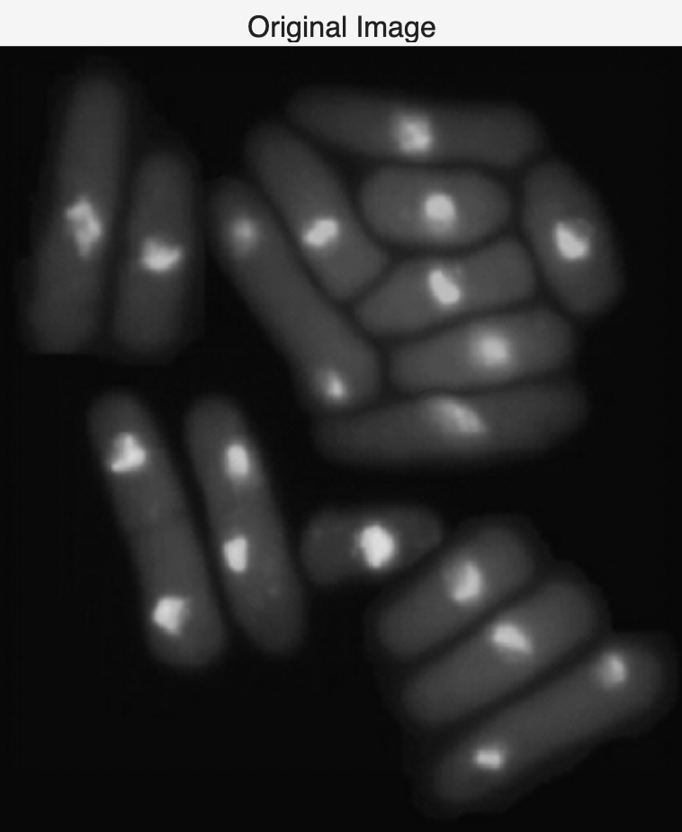

The original fluorescence microscopy image shows a number of elongated yeast cells on a dark background. Each cell appears as a bright grey region with a brighter spot (nucleus) inside. Several cells are visibly touching or overlapping each other, particularly in the central cluster.

**Figure 2 — Otsu's Segmentation (T = 0.165)**

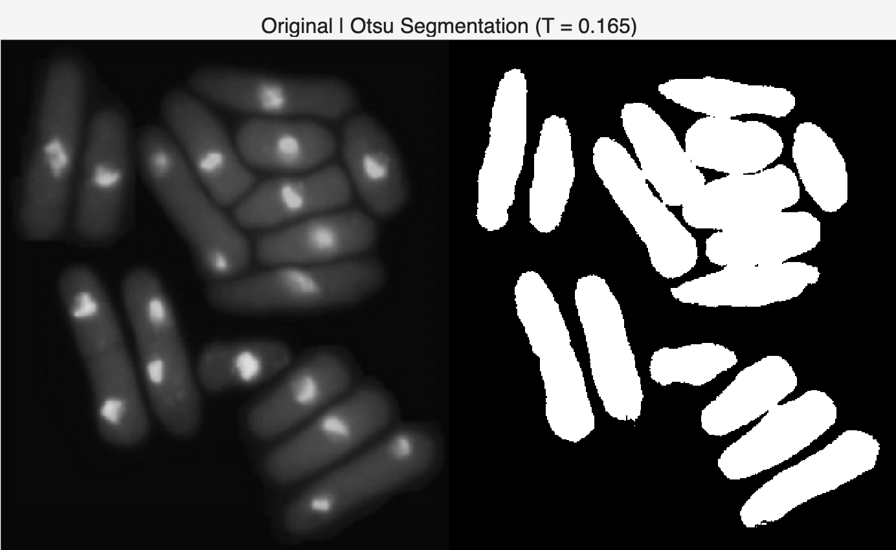

Otsu's method automatically determined a threshold of T = 0.165, separating the bright cells from the dark background. The binary result correctly identifies the cells as white foreground regions. However, cells that are touching each other are merged into a single connected white region, making it impossible to count or separate them individually. This is the key limitation of global thresholding — it has no spatial awareness of individual object boundaries.

**Figure 3 — Original | Otsu | Watershed Segmentation**

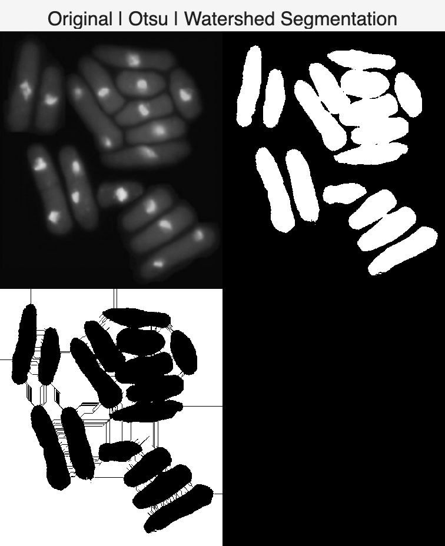

The Watershed segmentation result (bottom-left) shows that the touching cells have been separated. The algorithm works by treating the distance transform of the binary image as a topographic surface, then finding the "ridges" (watershed lines) between separate regions. Compared to Otsu, more individual cells are distinguishable as separate regions.

**Figure 4 — Watershed: Detected Cell Boundaries**

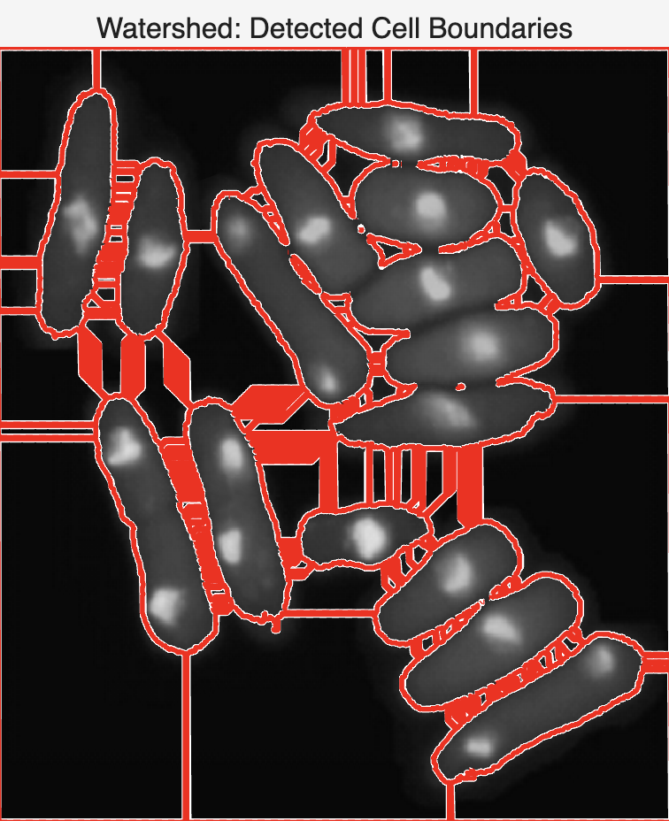

The red boundaries overlaid on the original image show where the Watershed algorithm has drawn dividing lines between cells. Individual cells are clearly outlined, including those that were previously merged by Otsu's method. However, some over-segmentation is visible — a few cells are split into multiple regions, and some boundary lines extend into the background. This is a known limitation of the Watershed approach when applied without careful pre-processing.


### Conclusion

Otsu's method successfully separates cells from the background but fails to distinguish touching cells, as it operates purely on intensity values without any spatial context. Watershed segmentation addresses this by using the distance transform to find natural separation boundaries between objects, allowing touching cells to be segmented individually. However, Watershed can over-segment if not carefully tuned.


### What I Learnt & Reflections

- Otsu's method finds the optimal global threshold by minimising intra-class intensity variance — it works well for separating foreground from background but cannot handle touching objects.
- The Watershed algorithm treats the image as a topographic surface; "water" fills from local minima and watershed lines form where different "basins" meet — effectively separating touching regions.
- Over-segmentation is a common issue with Watershed; pre-processing steps like smoothing or using marker-controlled Watershed can reduce this.
- This task highlighted that no single method is perfect — the choice of segmentation technique depends heavily on the image content and the specific goal.


## Task 5: Segmentation by K-Means Clustering

### Objective
The goal of this task is to apply k-means clustering to segment images by colour. Each pixel is treated as a point in 3D RGB colour space, and k-means groups pixels into k clusters based on colour similarity. The effect of different k values is explored on two images: `baboon.png` and `peppers.png`.


### Code
```matlab
clear all; close all;

%% ===== BABOON =====
f = imread('assets/baboon.png');
[M N S] = size(f);
F = reshape(f, [M*N S]);
R = F(:,1); G = F(:,2); B = F(:,3);
C = double(F)/255;

% Figure 1: 3D scatter plot with k-means centres
figure(1);
scatter3(R, G, B, 1, C);
xlabel('RED', 'FontSize', 14);
ylabel('GREEN', 'FontSize', 14);
zlabel('BLUE', 'FontSize', 14);
title('Baboon - RGB colour space scatter plot');

k = 10;
[L, centers] = imsegkmeans(f, k);
hold on;
scatter3(centers(:,1), centers(:,2), centers(:,3), 100, 'black', 'fill');
title('Baboon - RGB scatter with k-means centres (k=10)');

% Figure 2: Original vs segmented (k=10)
J = label2rgb(L, im2double(centers));
figure(2);
montage({f, J});
title('Baboon: Original | k-means Segmented (k=10)');

% Figure 3: Different k values
figure(3);
results = {f};
for k = [2, 5, 10, 20]
    [L, centers] = imsegkmeans(f, k);
    J = label2rgb(L, im2double(centers));
    results{end+1} = J;
end
montage(results);
title('Baboon: Original | k=2 | k=5 | k=10 | k=20');

%% ===== PEPPERS =====
p = imread('assets/peppers.png');
[M N S] = size(p);
F = reshape(p, [M*N S]);
R = F(:,1); G = F(:,2); B = F(:,3);
C = double(F)/255;

% Figure 4: Peppers scatter plot
figure(4);
scatter3(R, G, B, 1, C);
xlabel('RED', 'FontSize', 14);
ylabel('GREEN', 'FontSize', 14);
zlabel('BLUE', 'FontSize', 14);
title('Peppers - RGB colour space scatter plot');

% Figure 5: Different k values for peppers
figure(5);
results2 = {p};
for k = [2, 5, 10, 20]
    [L, centers] = imsegkmeans(p, k);
    J = label2rgb(L, im2double(centers));
    results2{end+1} = J;
end
montage(results2);
title('Peppers: Original | k=2 | k=5 | k=10 | k=20');
```


### Results & Analysis

#### Baboon

**Figure 1 — RGB Colour Space Scatter Plot with K-Means Centres (k=10)**

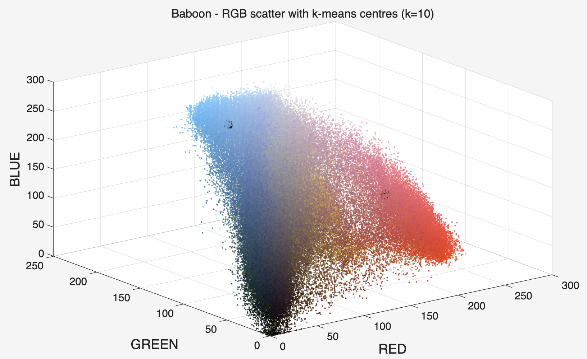

Each pixel in the baboon image is plotted as a coloured dot in 3D RGB space. The scatter plot reveals that the baboon's colours span a wide range — from dark blues and greens (fur) to bright reds and oranges (nose and face markings). The 10 black filled circles mark the k-means cluster centres, each representing the mean colour of one cluster. The centres are well spread across the colour space, capturing the dominant colour regions in the image.

**Figure 2 — Original vs K-Means Segmented (k=10)**

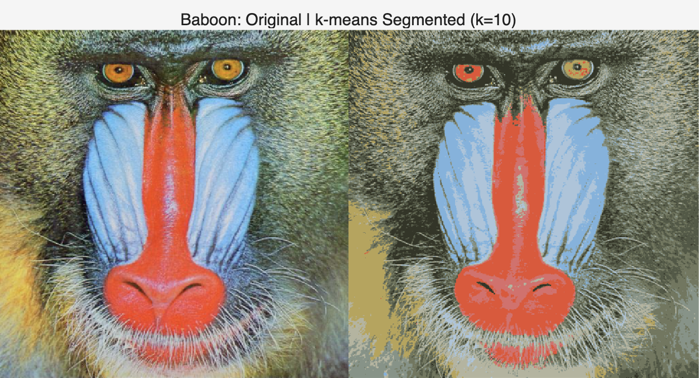

With k=10, the segmented image preserves the main colour regions of the baboon face well. The red nose, blue facial ridges, orange eyes, and grey-green fur are all clearly distinguishable as separate segments. Some fine texture detail is lost, as pixels within each cluster are all replaced by their cluster mean colour, giving a flat "posterised" appearance.

**Figure 3 — Baboon: Effect of Different k Values**

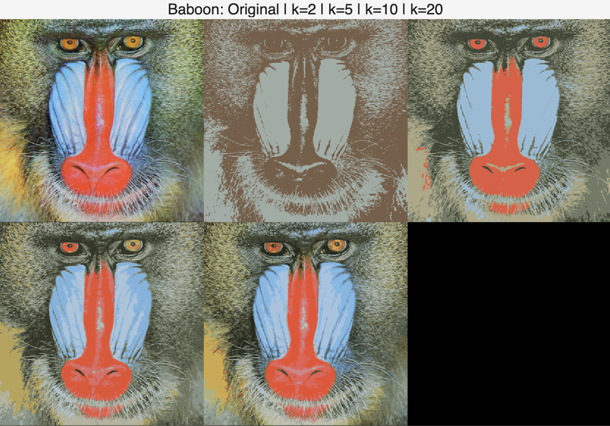

- **k=2**: Only two colours — the image is reduced to a very coarse representation with little detail. Most of the face features are merged together.
- **k=5**: More detail emerges. The red nose, blue ridges, and fur are roughly separated, but colours are still quite flat.
- **k=10**: Good balance between detail and simplicity. The key facial features are well separated.
- **k=20**: Very close to the original in appearance. More subtle colour variations in the fur and face are captured, though the difference from k=10 is marginal.


#### Peppers

**Figure 4 — Peppers RGB Colour Space Scatter Plot**

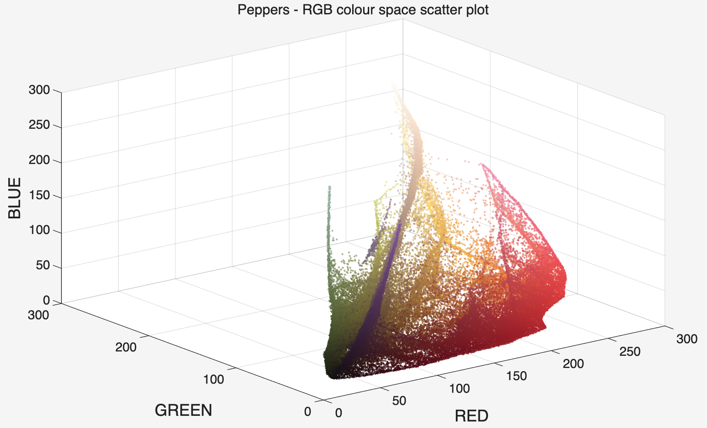

The peppers image has a more structured colour distribution compared to the baboon. The scatter plot shows distinct clusters corresponding to the red, green, yellow, and purple colours in the image. The points form more clearly separated groups, suggesting that k-means should perform well on this image.

**Figure 5 — Peppers: Effect of Different k Values**

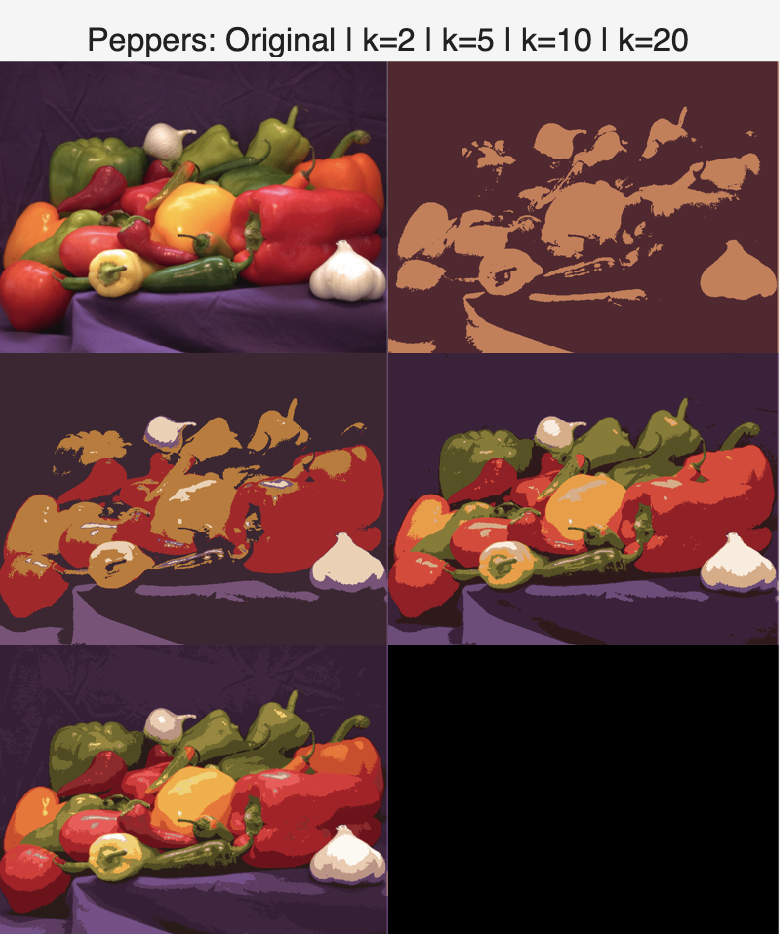

- **k=2**: The image is split into only two tones — most colour information is lost, and individual peppers are not distinguishable.
- **k=5**: Individual peppers begin to appear in distinct colours. The red, green, and background purple are roughly captured.
- **k=10**: The segmentation closely matches the original, with red, green, yellow, and orange peppers all well separated. The garlic and purple background are also clearly distinct.
- **k=20**: Very similar to k=10 but with finer colour gradations within each pepper, producing a result very close to the original image.


### Conclusion

K-means clustering is an effective method for colour-based image segmentation. By treating each pixel as a point in RGB colour space, the algorithm groups similar colours together and replaces each pixel with its cluster mean. Increasing k improves visual fidelity but also increases computational cost. For the baboon image, k=10 gives a good balance; for the peppers image, k=10 already produces a result very close to the original due to its more distinct colour regions.


### What I Learnt & Reflections

- K-means clustering segments images by grouping pixels with similar RGB values — it has no spatial awareness, only colour similarity.
- The 3D scatter plot is a useful tool for visualising how colours are distributed in an image and where cluster centres are placed.
- A higher k value produces more colour detail but with diminishing returns — beyond a certain point, increasing k has little visible effect.
- The peppers image segmented more cleanly than the baboon image because its colours are more distinctly separated in RGB space, as seen in the scatter plots.
- K-means results can vary slightly between runs due to random initialisation of cluster centres.

## Task 6: Watershed Segmentation with Distance Transform

### Objective
The goal of this task is to segment an image of circular wooden dowels viewed end-on, separating each individual dowel into its own region — including those that are touching. The pipeline combines Otsu thresholding, morphological cleaning, distance transform, and Watershed segmentation.


### Code
```matlab
% Watershed segmentation with Distance Transform
clear all; close all;

%% Step 1: Read and binarize image
I = imread('assets/dowels.tif');
f = im2bw(I, graythresh(I));
g = bwmorph(f, "close", 1);
g = bwmorph(g, "open", 1);

figure(1)
montage({I, g});
title('Original & binarized cleaned image')

%% Step 2: Distance Transform
gc = imcomplement(g);
D = bwdist(gc);
figure(2)
imshow(D, [min(D(:)) max(D(:))])
title('Distance Transform')

%% Step 3: Watershed on complement of distance transform
L = watershed(imcomplement(D));
figure(3)
imshow(L, [0 max(L(:))])
title('Watershed Segmented Label')

%% Step 4: Merge everything to show final segmentation
W = (L==0);
g2 = g | W;
figure(4)
montage({I, g, W, g2}, 'size', [2 2]);
title('Original Image - Binarized Image - Watershed regions - Merged dowels and segmented boundaries')
```


### Results & Analysis

**Figure 1 — Original & Binarized Cleaned Image**

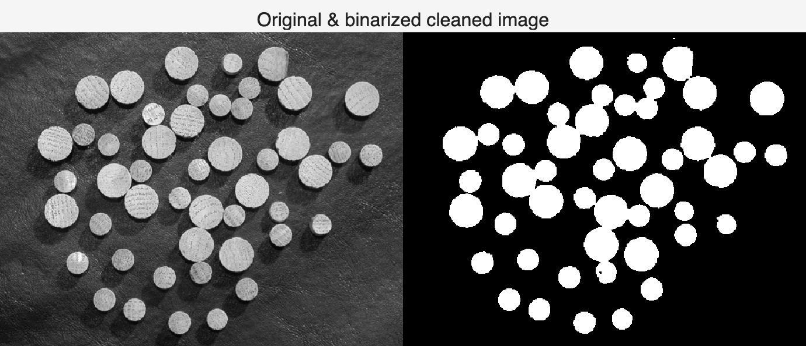

The left panel shows the original grayscale image of dowels on a dark cloth background. The right panel shows the result after Otsu thresholding followed by morphological closing and opening. The dowels appear as clean white circles on a black background. The morphological operations are essential here — the wood grain texture on each dowel creates internal noise after thresholding, and without closing and opening, the binary image would contain many small holes and fragments inside each dowel region.

**Figure 2 — Distance Transform**

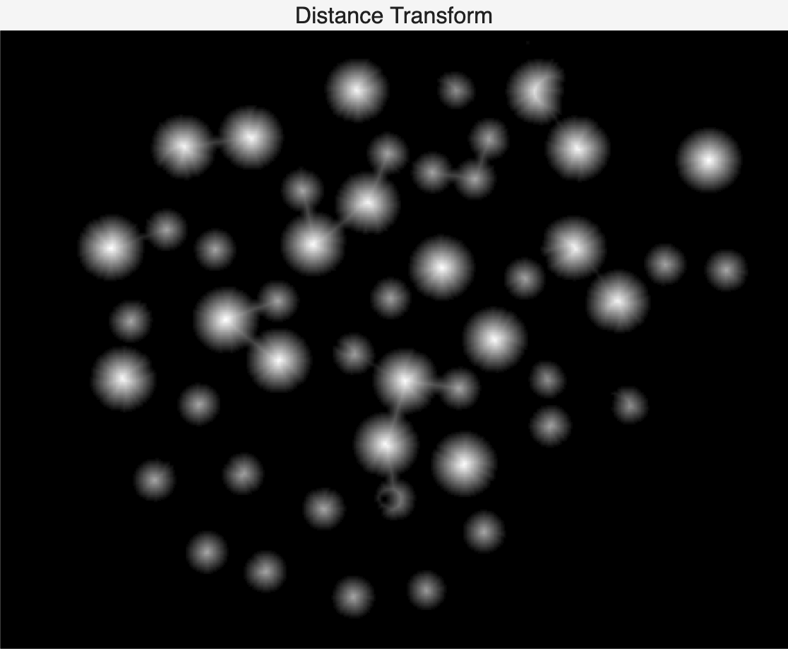

The distance transform assigns each foreground pixel a value equal to its distance to the nearest background pixel. The result shows bright "hills" at the centre of each dowel (where pixels are furthest from the background) and darker values towards the edges. This effectively converts each circular dowel into a smooth dome-shaped surface in intensity space, which is ideal input for the Watershed algorithm.

The distance transform is computed on `gc` (the complement of `g`) rather than `g` directly, because `bwdist` measures distance to the nearest **white** pixel. By complementing the binary image, the background becomes white, so the distance values are measured from each foreground pixel to the nearest background — giving the largest values at the centre of each dowel.

**Figure 3 — Watershed Segmented Label**

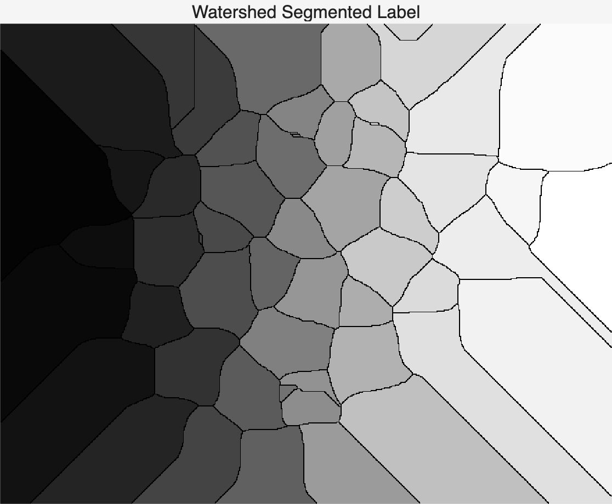

The Watershed algorithm is applied to the complement of the distance transform, treating it as a topographic surface where the "valleys" correspond to dowel centres. Each region is assigned a unique integer label. The image appears as a gradient from dark (left, low label numbers) to light (right, high label numbers) because `imshow(L, [0 max(L(:))])` maps label values linearly to greyscale — regions with smaller label indices appear darker, and those assigned higher indices appear lighter. The thin black lines between regions are the watershed boundaries.

**Figure 4 — Final Segmentation Montage**

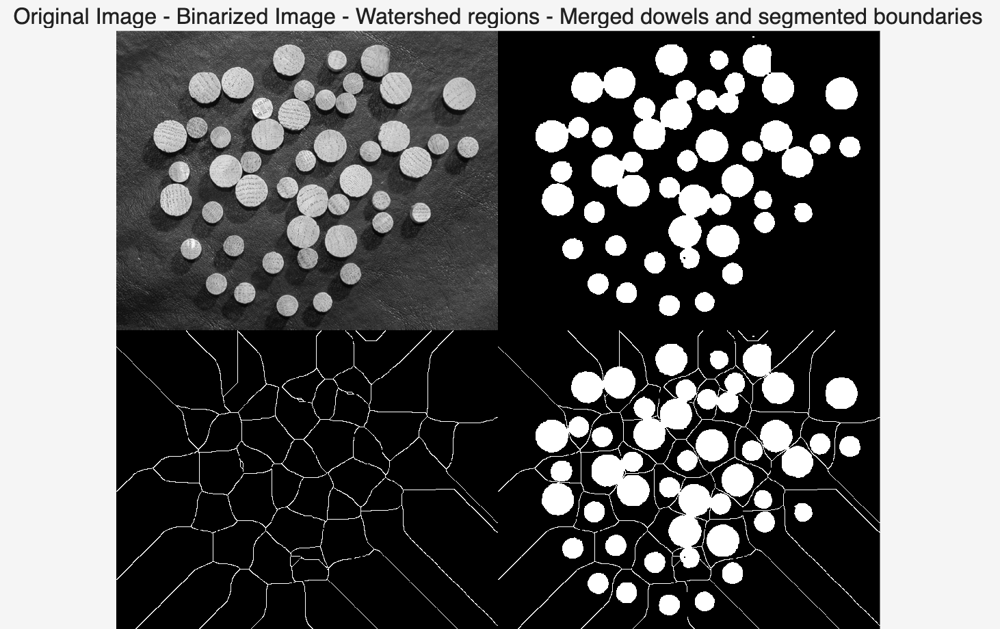

The four panels show the complete pipeline:

- **Top-left — Original image**: the raw grayscale dowel image.
- **Top-right — Binarized image (`g`)**: dowels as white circles after thresholding and morphological cleaning.
- **Bottom-left — Watershed boundaries (`W`)**: only the boundary lines where `L == 0`, showing the dividing lines between adjacent dowel regions.
- **Bottom-right — Merged result (`g2`)**: the binary dowel mask overlaid with the watershed boundary lines. Each dowel is clearly separated from its neighbours, including those that were touching in the original image.


### Conclusion

The combination of distance transform and Watershed segmentation successfully separates touching dowels that a simple thresholding approach would merge together. The key insight is that the distance transform creates a smooth "dome" surface for each circular object, allowing Watershed to find natural dividing lines between adjacent objects at the points where their domes meet. Morphological cleaning before the transform was essential to remove wood grain noise that would otherwise create false peaks and over-segmentation.


### What I Learnt & Reflections

- The distance transform is a powerful pre-processing step for Watershed — it converts flat binary regions into smooth surfaces with peaks at object centres, making it much easier to find separation boundaries.
- Morphological `close` fills small holes inside objects, while `open` removes small isolated noise pixels — both are important for producing a clean binary image before further processing.
- The Watershed label image appears as a left-to-right greyscale gradient because labels are assigned sequentially, not randomly — this is expected behaviour and not an error.
- This approach works particularly well for circular or convex objects; for irregular or elongated shapes, additional pre-processing (such as marker-controlled Watershed) would be needed to avoid over-segmentation.

## Challenge 1: Match Detection and Counting

### Objective
Detect and count all matches in the image `random_matches.tif` using morphological processing and skeleton-based connected component analysis.


### Code
```matlab
clear all; close all;

I = imread('assets/random_matches.tif');
if size(I, 3) == 3
    I = rgb2gray(I);
end

T = graythresh(I);
bw = im2bw(I, T * 1.1);
bw = bwareaopen(bw, 3000);

figure(1);
imshow(bw);
title('Binary image - cleaned');

skel = bwmorph(bw, 'thin', Inf);
branch = bwmorph(skel, 'branchpoints');
branch = imdilate(branch, strel('disk', 4));
skel2 = skel & ~branch;
skel2 = bwareaopen(skel2, 60);

L = bwlabel(skel2);
num_matches = max(L(:));
fprintf('Number of matches detected: %d\n', num_matches);

figure(2);
imshow(I); hold on;
colors = hsv(num_matches);
for k = 1:num_matches
    idx = find(L == k);
    [r, c] = ind2sub(size(L), idx);
    plot(c, r, '.', 'Color', colors(k,:), 'MarkerSize', 4);
end
title(sprintf('Detected matches — Count: %d', num_matches));
```


### Results

**Figure 1 — Cleaned Binary Image**

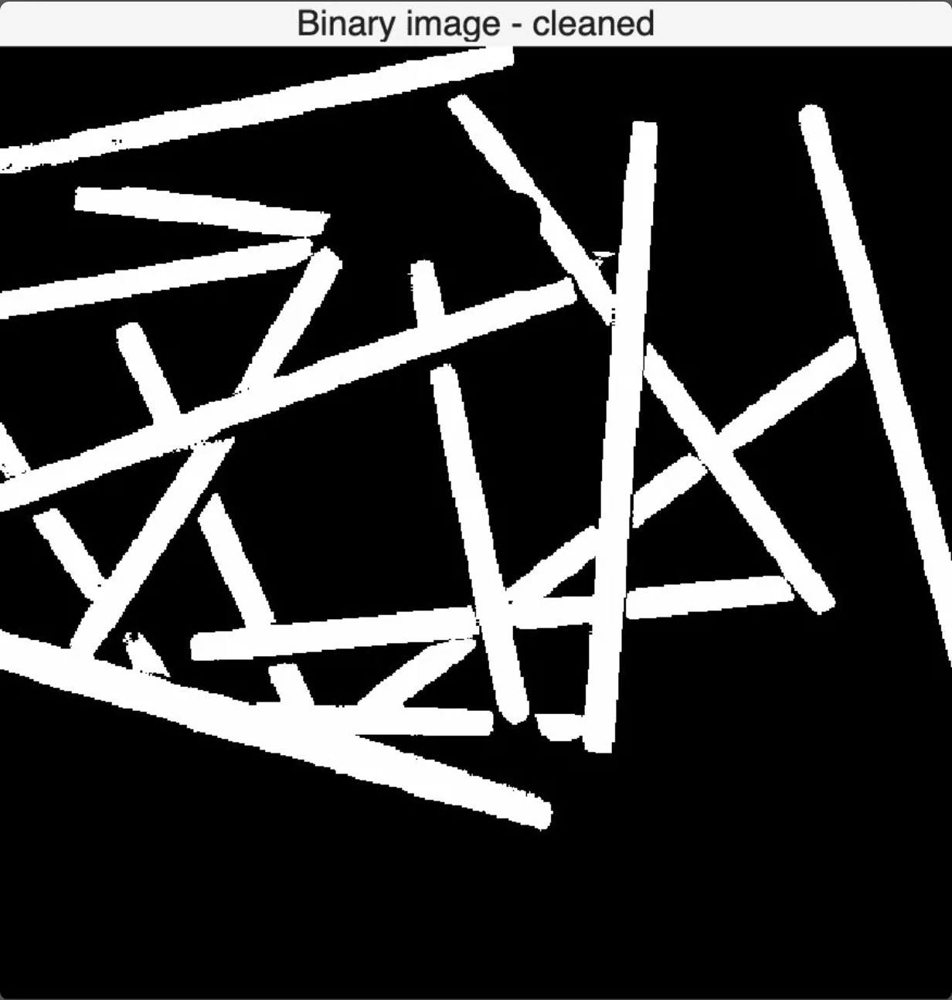

After applying a slightly elevated Otsu threshold (`T * 1.1`) and removing regions smaller than 3000 pixels, the binary image shows clean white match sticks on a black background with minimal background noise.

**Figure 2 — Detected and Labelled Matches**

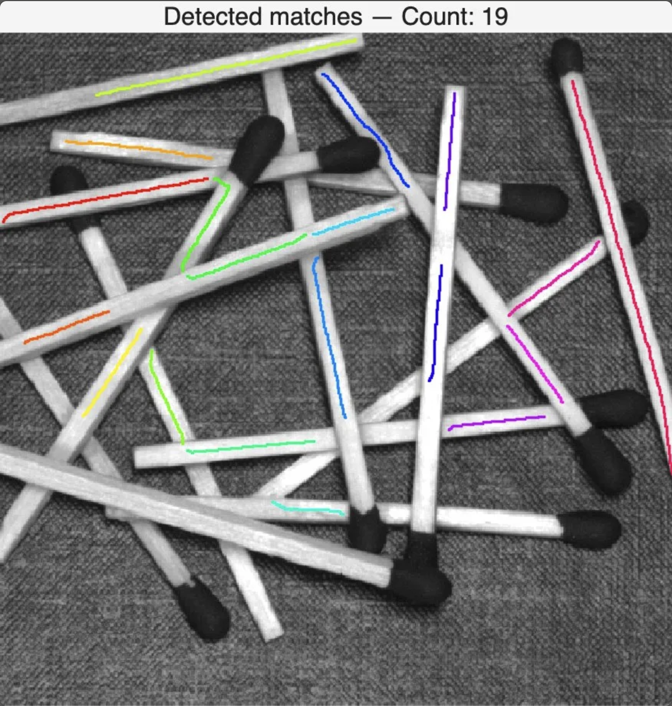

The algorithm detected **19 matches**, while a careful manual count of the visible matches in the original image gives **15**. The over-count of 4 is likely due to some matches being split into multiple skeleton segments when branch points are removed at crossing points.


### Method Explained

- A higher-than-Otsu threshold was used to suppress the grey carpet texture from the background.
- `bwareaopen` removed small noise regions, keeping only match-sized objects.
- `bwmorph('thin')` reduced each match to a 1-pixel-wide skeleton.
- Branch points (where two matches cross) were detected and dilated, then removed from the skeleton — effectively cutting matches apart at their crossing points.
- Short skeleton fragments (below 60 pixels) were discarded as noise.
- The remaining connected components were labelled and counted.


### What I Learnt & Reflections

- Skeletonization followed by branch point removal is an effective way to separate crossing elongated objects that cannot be separated by thresholding alone.
- The threshold multiplier (`T * 1.1`) and minimum area (`bwareaopen`) required careful tuning to balance noise removal against losing actual match data.
- The algorithm detected **19 matches**, however the actual number of matches in the image is **15**. The over-count is likely due to some matches being split into multiple segments at their crossing points, where the branch point removal cuts one match into two or more fragments. A larger dilation radius for branch point removal or a longer minimum skeleton length could reduce this error.
- This task demonstrated that even a well-designed pipeline may not achieve perfect results — understanding and explaining the source of errors is an important part of image processing work.


## Challenge 2: F14 Fighter Jet Segmentation

### Objective
Produce a binary image of `f14.png` where only the F14 fighter jet is shown as white and the rest of the image (sky and ground) is black.


### Code
```matlab
clear all; close all;

I = imread('assets/f14.png');
figure(1);
imshow(I);
title('Original F14 Image');

if size(I, 3) == 3
    Igray = rgb2gray(I);
else
    Igray = I;
end

T = graythresh(Igray);
bw = ~imbinarize(Igray, T);    % invert: jet is darker than background

figure(2);
imshow(bw);
title('After invert');

bw = imfill(bw, 'holes');
bw = bwareaopen(bw, 500);

L = bwlabel(bw);
stats = regionprops(L, 'Area');
areas = [stats.Area];
[~, largest] = max(areas);
bw_jet = (L == largest);

figure(3);
montage({Igray, uint8(bw_jet * 255)});
title('Original | F14 Binary Mask');
```


### Results

**Figure 1 — Original Image**

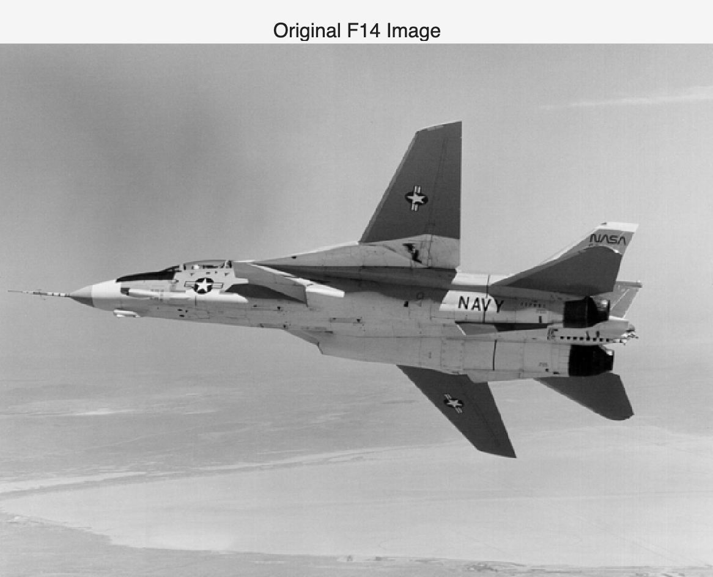

The original grayscale image shows an F14 fighter jet flying against a bright sky background. The jet body is noticeably darker than the surrounding sky, which is key to the segmentation approach.

**Figure 2 — After Inversion**

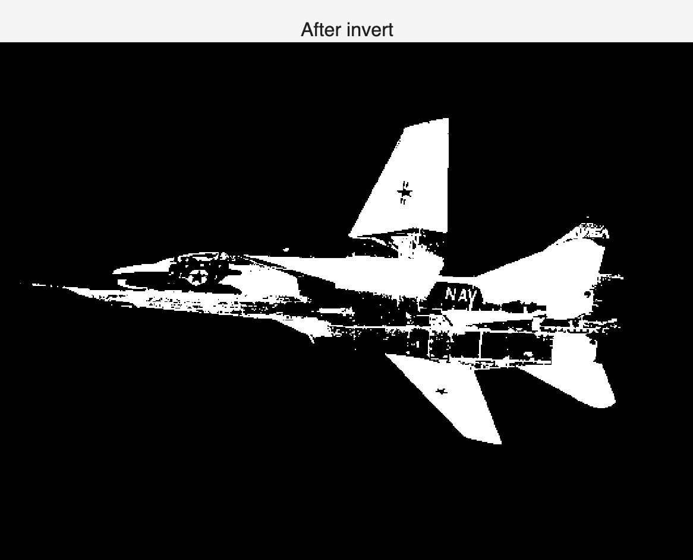

After applying Otsu's threshold and inverting the result, the jet appears as a white region on a black background. The inversion is necessary because the jet is darker than the sky — a standard Otsu threshold without inversion would produce the opposite result (sky = white, jet = black).

**Figure 3 — Original vs Binary Mask**

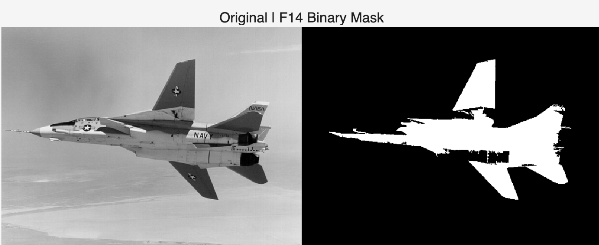

The final binary mask clearly shows the F14 jet as white against a fully black background. Some small internal holes remain within the jet body due to dark engine and cockpit regions having similar intensity to the background. The overall shape and silhouette of the jet is well captured.


### Conclusion

The key challenge in this task was recognising that the jet is **darker** than the background, which means a standard Otsu threshold produces the wrong polarity. Inverting the binary image corrects this. The largest connected component was then selected to remove any remaining small noise regions from the ground visible at the bottom of the image.


### What I Learnt & Reflections

- When the foreground object is darker than the background, the binary result from Otsu must be inverted to get the correct segmentation.
- `imfill` helps close internal holes caused by dark features within the jet (e.g. cockpit, engines), but some holes remain where intensity is very similar to the background.
- Selecting only the largest connected component is a simple but effective way to remove unwanted small regions without manual parameter tuning.
- A more precise result could be achieved using more advanced techniques such as active contours or GrabCut, which take spatial context into account rather than relying purely on intensity thresholding.


