## Task 1: Image Pyramid

### Objective
Build an image pyramid of `cafe_van_gogh.jpg` at scales 1/2, 1/4, 1/8, 1/16, and 1/32 using two methods: (1) decimation by dropping every other rows/columns, and (2) resizing with `imresize`. Compare the two approaches and their visual differences.


### Code
```matlab
% Lab 6 Task 1 - Image Pyramid
clear all; close all;
f0 = imread('assets/cafe_van_gogh.jpg');

%% Method 1: Decimation by dropping every other rows and columns
f1 = f0(1:2:end, 1:2:end, :);   % 1/2
f2 = f1(1:2:end, 1:2:end, :);   % 1/4
f3 = f2(1:2:end, 1:2:end, :);   % 1/8
f4 = f3(1:2:end, 1:2:end, :);   % 1/16
f5 = f4(1:2:end, 1:2:end, :);   % 1/32

figure(1);
montage({f0, f1, f2, f3, f4, f5}, 'Size', [2 3]);
title('Method 1: Drop every other rows/columns (no pre-filter)', 'FontSize', 14);

%% Method 2: Proper resizing with imresize
f_1 = imresize(f0, 0.5);   % 1/2
f_2 = imresize(f_1, 0.5);  % 1/4
f_3 = imresize(f_2, 0.5);  % 1/8
f_4 = imresize(f_3, 0.5);  % 1/16
f_5 = imresize(f_4, 0.5);  % 1/32

figure(2);
montage({f0, f_1, f_2, f_3, f_4, f_5}, 'Size', [2 3]);
title('Method 2: imresize (lowpass filter + subsampling)', 'FontSize', 14);

%% Compare 1/8 images from both methods
figure(3); imshow(f0);  title('Original Image', 'FontSize', 14);
figure(4); imshow(f_3); title('1/8 image (imresize - filtered)', 'FontSize', 11);
figure(5); imshow(f3);  title('1/8 image (drop samples - no filter)', 'FontSize', 11);
```


### Results & Analysis

**Figure 1 — Method 1: Drop every other rows/columns (no pre-filter)**

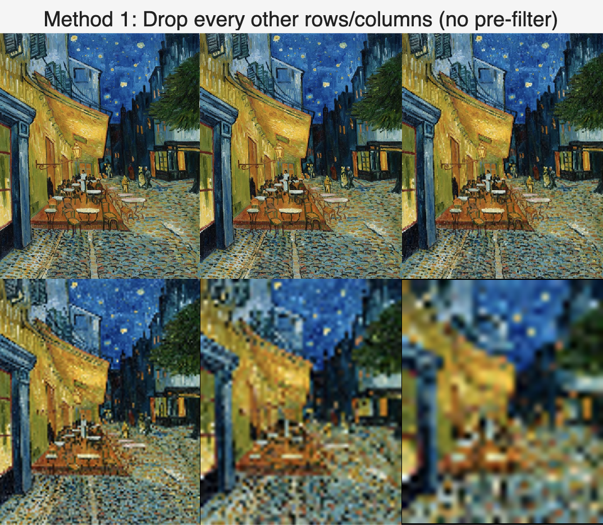

The montage was built by repeatedly using `I(1:2:end, 1:2:end)` to halve resolution at each level. No low-pass filter is applied before subsampling. Because high-frequency details (e.g. brushstrokes, cobblestone texture) are not removed before the sampling rate is reduced, aliasing occurs — producing jagged edges, moiré patterns, and false structures in the smaller images.

**Figure 2 — Method 2: imresize (lowpass filter + subsampling)**

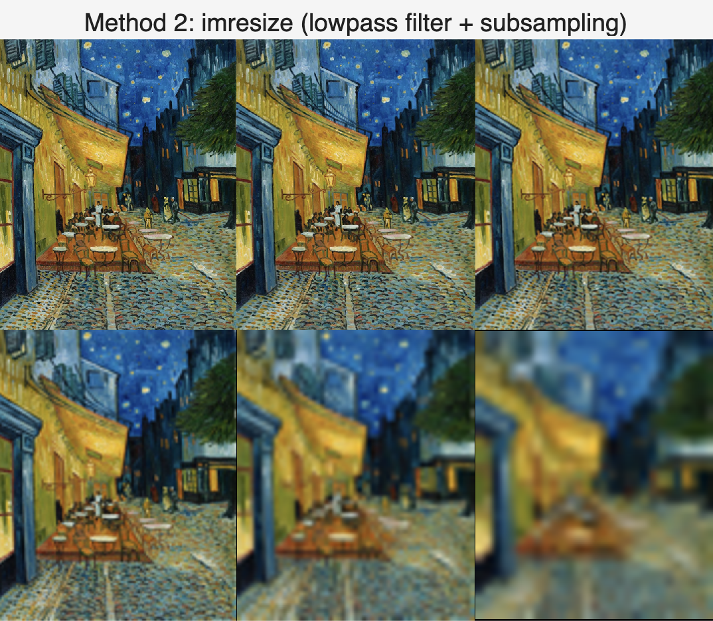

The montage was built by repeatedly calling `imresize(..., 0.5)`. Unlike Method 1, `imresize` applies a low-pass (Gaussian) filter before subsampling. High frequencies are removed first, so the images become progressively blurrier but remain smooth, and aliasing artefacts are largely avoided.

**Figure 3 — Original Image**

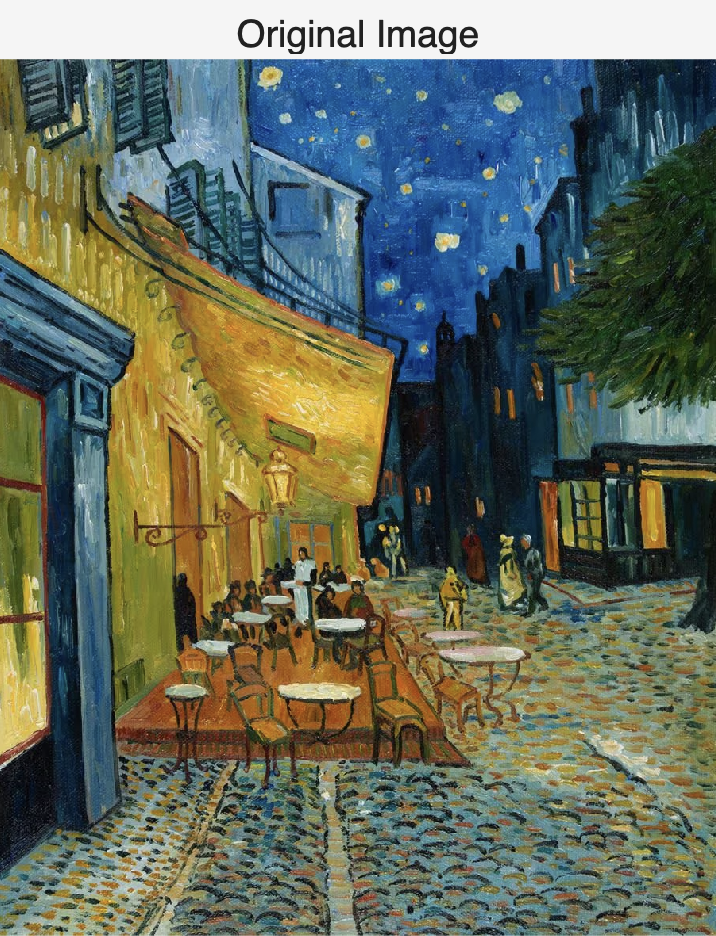

The original image provides the reference for comparing both methods.

**Figure 4 — 1/8 Scale (imresize)**

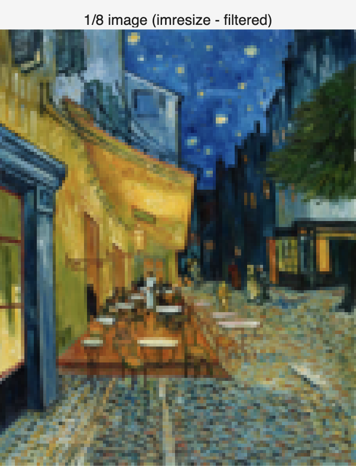

At 1/8 scale, the filtered image is blocky but smooth. Edges and textures are blurred rather than jagged, because high frequencies were removed before downsampling.

**Figure 5 — 1/8 Scale (drop samples)**

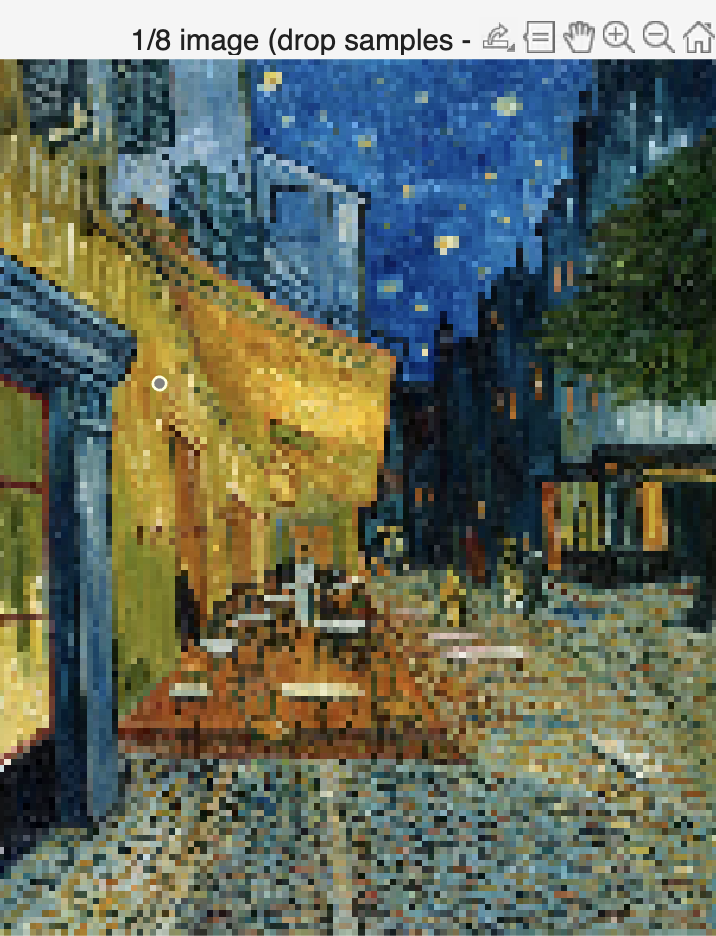

At 1/8 scale, the drop-sampling version shows clear aliasing: staircase edges, moiré-like patterns in cobblestones and other textures, and false structures. This clearly illustrates the consequence of subsampling without a pre-filter.


### Conclusion

Method 1 (drop rows/columns) is simple but causes aliasing because high frequencies are not removed before subsampling. Method 2 (`imresize`) uses a low-pass filter before subsampling, which avoids aliasing but introduces blur. For building image pyramids or any form of downsampling, pre-filtering with `imresize` is preferable to reduce artefacts. The side-by-side comparison at 1/8 scale clearly demonstrates the difference between the two approaches.


### What I Learnt & Reflections

- Subsampling without a low-pass filter leads to aliasing — visible as jaggies and moiré patterns in textured images.
- `imresize` applies Gaussian filtering before subsampling, which trades sharpness for correct representation at lower resolution.
- The `(1:2:end)` slicing syntax is a simple and efficient way to perform decimation in MATLAB, but must be paired with pre-filtering to avoid artefacts.
- This task demonstrated why the Nyquist theorem matters in practice: sampling below twice the highest frequency in the signal causes irreversible information loss and aliasing.


## Task 2: Pattern Matching with Normalized Cross Correlation

### Objective
Use MATLAB's `normxcorr2` function to perform template matching — locating a small template image within a larger image (`salvador_grayscale.tif`) by finding the position of maximum Normalized Cross Correlation (NCC) value.


### Code
```matlab
clear all; close all;

%% ===== Template 1 =====
f = imread('assets/salvador_grayscale.tif');
w = imread('assets/template1.tif');

c = normxcorr2(w, f);

figure(1);
surf(c);
shading interp;
title('NCC Surface Plot - Template 1');
xlabel('X'); ylabel('Y'); zlabel('NCC value');
colormap hot; colorbar;

[ypeak, xpeak] = find(c == max(c(:)));
yoffSet = ypeak - size(w, 1);
xoffSet = xpeak - size(w, 2);

fprintf('Template 1 found at: x=%d, y=%d\n', xoffSet, yoffSet);
fprintf('Peak NCC value: %.4f\n', max(c(:)));

figure(2);
imshow(f);
title('Template 1 Match Location');
drawrectangle(gca, 'Position', ...
    [xoffSet, yoffSet, size(w,2), size(w,1)], 'FaceAlpha', 0);

%% ===== Template 2 =====
w2 = imread('assets/template2.tif');

c2 = normxcorr2(w2, f);

figure(3);
surf(c2);
shading interp;
title('NCC Surface Plot - Template 2');
xlabel('X'); ylabel('Y'); zlabel('NCC value');
colormap hot; colorbar;

[ypeak2, xpeak2] = find(c2 == max(c2(:)));
yoffSet2 = ypeak2 - size(w2, 1);
xoffSet2 = xpeak2 - size(w2, 2);

fprintf('Template 2 found at: x=%d, y=%d\n', xoffSet2, yoffSet2);
fprintf('Peak NCC value: %.4f\n', max(c2(:)));

figure(4);
imshow(f);
title('Template 2 Match Location');
drawrectangle(gca, 'Position', ...
    [xoffSet2, yoffSet2, size(w2,2), size(w2,1)], 'FaceAlpha', 0);
```


### Results & Analysis

**Figure 1 — NCC Surface Plot: Template 1**

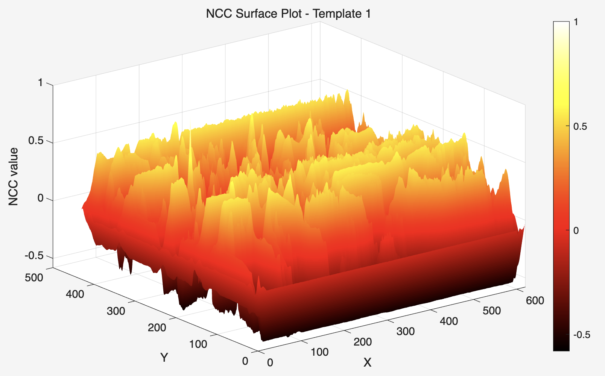

The NCC surface for Template 1 shows a relatively flat landscape with many moderate peaks across the image. There is no single sharp dominant spike, which suggests Template 1 contains features (such as texture or tone) that partially match many regions of the image. However, `find(c == max(c(:)))` correctly identifies the global maximum, which corresponds to the true match location.

**Figure 2 — Template 1 Match Location**

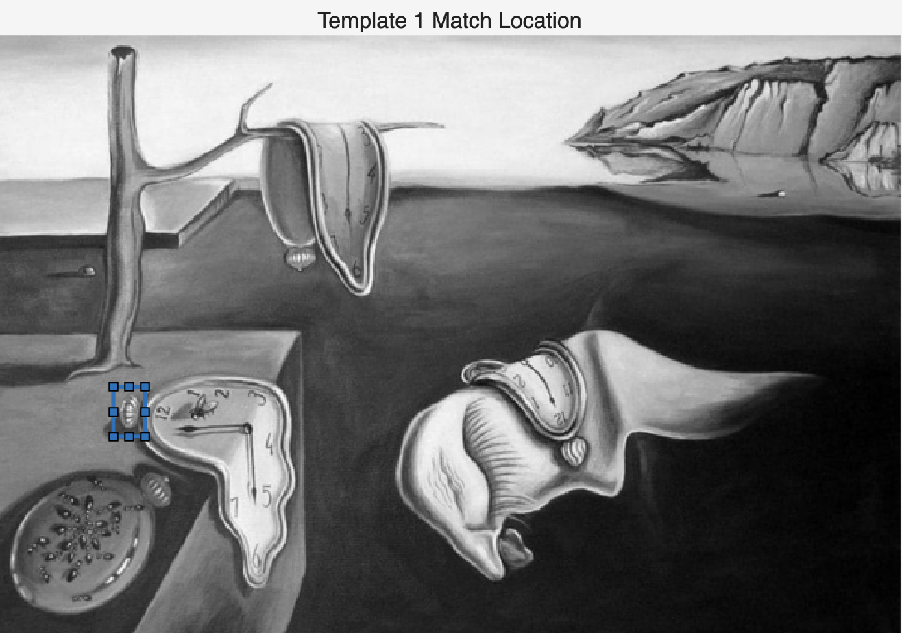

The blue dashed rectangle is drawn at the position of the peak NCC value. It correctly locates a small region on the left side of the painting, near the melting clock — confirming that Template 1 was extracted from that area of the image.

**Figure 3 — NCC Surface Plot: Template 2**

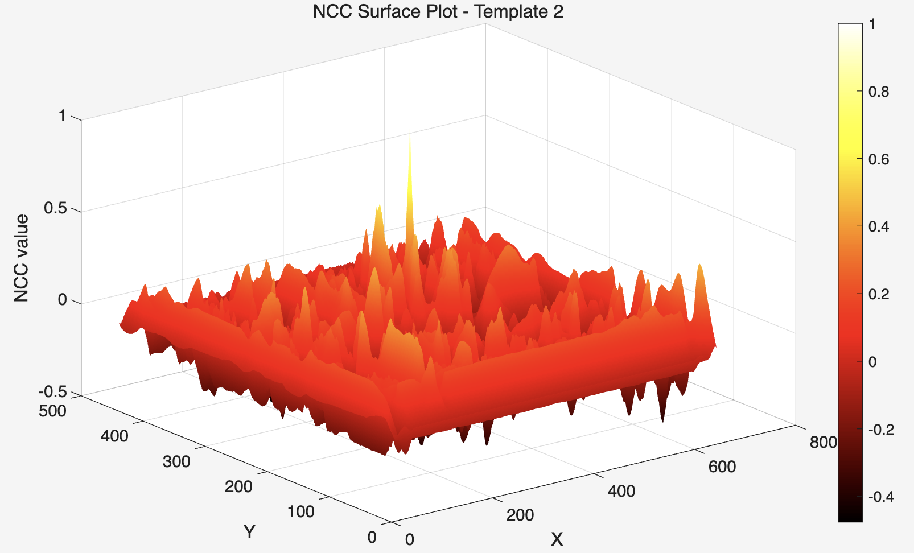

The NCC surface for Template 2 shows a much more prominent and isolated spike — a single tall peak that stands clearly above the rest of the surface. This indicates that Template 2 contains more distinctive features that match strongly at only one location in the image, making the peak easier to identify visually.

**Figure 4 — Template 2 Match Location**

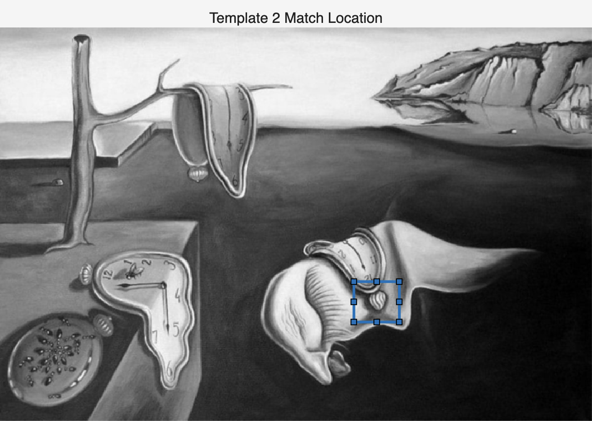

The blue dashed rectangle correctly locates Template 2 on the right side of the painting, within the melting clock draped over the face-like figure. The match is precise and unambiguous.


### About `find()`

The MATLAB function `find()` returns the indices of non-zero elements in an array. In this context:
```matlab
[ypeak, xpeak] = find(c == max(c(:)));
```

`max(c(:))` flattens the NCC matrix and finds the maximum value. `find(c == max(c(:)))` then returns the row and column indices where that maximum value occurs — i.e. the (y, x) location of the best match. The offset calculation (`ypeak - size(w,1)`) converts from NCC output coordinates back to the original image coordinates.


### Conclusion

`normxcorr2` successfully located both templates within the painting. Template 2 produced a sharper and more isolated NCC peak than Template 1, suggesting it contains more distinctive local features. This demonstrates a key property of NCC-based template matching: it works best when the template has unique features that do not appear elsewhere in the image. NCC can only match a template if the match is exact or nearly exact — changes in scale, rotation, or illumination would cause the peak to drop significantly.


### What I Learnt & Reflections

- `normxcorr2` computes a normalised similarity score at every possible position of the template within the image — a score of 1.0 means a perfect match.
- The shape of the NCC surface reveals how distinctive the template is: a sharp isolated peak means a unique match; a flat noisy surface means many similar regions exist.
- `find()` is used to convert the peak location in the NCC output back to image coordinates, with an offset correction for the template size.
- NCC is sensitive to exact pixel matches — it would fail if the template were scaled, rotated, or had different lighting. More robust methods (e.g. SIFT, SURF) are needed for such cases.


## Task 3: SIFT Feature Detection

### Objective
Apply SIFT feature detection to two paintings — `salvador.jpg` and `cafe_van_gogh.jpg` — and explore the `points` data structure. Additionally, compare SIFT with other feature detection methods available in MATLAB: SURF, Harris, and ORB.

---

### Code
```matlab
clear all; close all;

%% ===== Salvador Dali =====
I1 = imread('assets/salvador.jpg');
f1 = im2gray(I1);

points1 = detectSIFTFeatures(f1);

figure(1);
imshow(I1); hold on;
plot(points1.selectStrongest(100));
title(sprintf('SIFT Features - Salvador (top 100 of %d)', points1.Count));

fprintf('=== points data structure ===\n');
fprintf('Total SIFT points detected: %d\n', points1.Count);
fprintf('First point Location: (%.1f, %.1f)\n', points1.Location(1,1), points1.Location(1,2));
fprintf('First point Scale: %.4f\n', points1.Scale(1));
fprintf('First point Metric (strength): %.4f\n', points1.Metric(1));

figure(2);
imshow(I1); hold on;
plot(points1);
title(sprintf('SIFT Features - Salvador (all %d points)', points1.Count));

%% ===== Cafe Van Gogh =====
I2 = imread('assets/cafe_van_gogh.jpg');
f2 = im2gray(I2);

points2 = detectSIFTFeatures(f2);

figure(3);
imshow(I2); hold on;
plot(points2.selectStrongest(100));
title(sprintf('SIFT Features - Cafe Van Gogh (top 100 of %d)', points2.Count));

%% ===== Other feature detection methods =====
pointsSURF = detectSURFFeatures(f1);
figure(4);
imshow(I1); hold on;
plot(pointsSURF.selectStrongest(100));
title(sprintf('SURF Features - Salvador (top 100 of %d)', pointsSURF.Count));

pointsHarris = detectHarrisFeatures(f1);
figure(5);
imshow(I1); hold on;
plot(pointsHarris.selectStrongest(100));
title(sprintf('Harris Features - Salvador (top 100 of %d)', pointsHarris.Count));

pointsORB = detectORBFeatures(f1);
figure(6);
imshow(I1); hold on;
plot(pointsORB.selectStrongest(100));
title(sprintf('ORB Features - Salvador (top 100 of %d)', pointsORB.Count));
```

---

### The `points` Data Structure

The variable `points` returned by `detectSIFTFeatures` is a `SIFTPoints` object containing the following key fields:

- **`Location`** — (x, y) coordinates of each detected keypoint in the image
- **`Scale`** — the scale at which the feature was detected, determining the size of the circle drawn around it
- **`Metric`** — a strength score indicating how distinctive the keypoint is; higher values indicate stronger, more reliable features
- **`Count`** — total number of keypoints detected
- **`selectStrongest(N)`** — a method that returns the N keypoints with the highest Metric values

---

### Results & Analysis

**Figure 1 — SIFT: Salvador (top 100 of 699)**

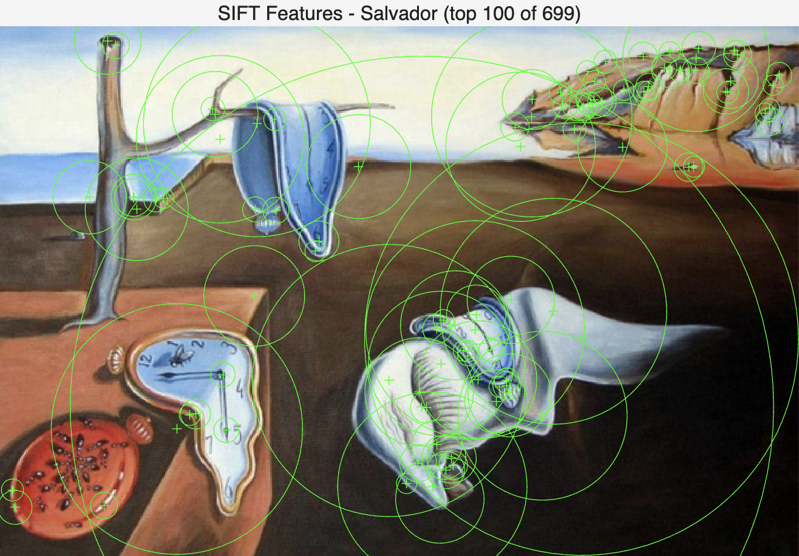

699 SIFT keypoints were detected in total. The top 100 strongest are shown as green circles, where the circle size reflects the feature scale. Keypoints are concentrated around high-detail regions — the melting clocks, the face-like figure, the ants, and the rocky cliff — which are areas with rich local texture and strong intensity gradients. Flat, uniform areas such as the sky and the dark background contain few or no keypoints.

**Figure 2 — SIFT: Salvador (all 699 points)**

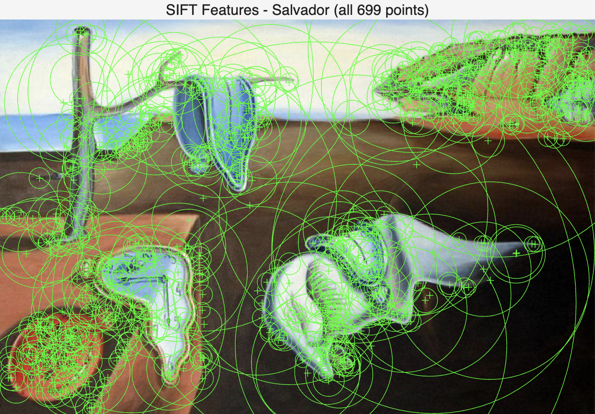

Displaying all 699 points shows that keypoints are distributed across every detailed region of the painting. The density is highest in the clocks and the face-like figure where fine detail is richest. The variety of circle sizes shows that SIFT detects features at multiple scales simultaneously.

**Figure 3 — SIFT: Cafe Van Gogh (top 100 of 8340)**

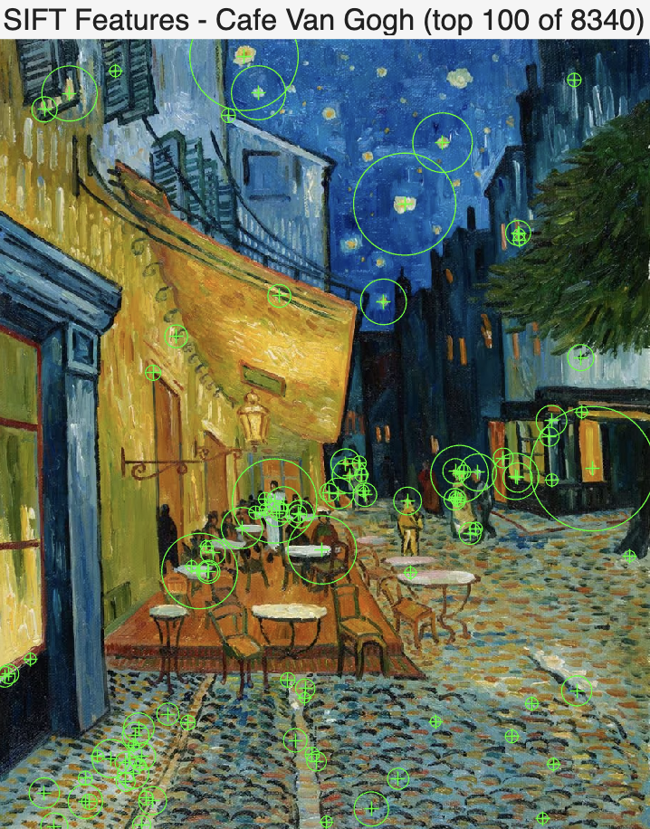

The Van Gogh painting produced 8340 SIFT keypoints — significantly more than the Dalí painting. This is because Van Gogh's brushstroke style creates highly textured surfaces across the entire image, generating a much larger number of local feature candidates. The top 100 keypoints are spread across the cobblestones, café furniture, stars, and building edges.

**Figure 4 — SURF: Salvador (top 100 of 370)**


SURF detected 370 keypoints, fewer than SIFT (699). The distribution is similar — concentrated around the clocks and the detailed figure — but the circles tend to be larger, reflecting SURF's use of box filters at coarser scales. SURF is generally faster than SIFT but slightly less precise.

**Figure 5 — Harris: Salvador (top 100 of 387)**

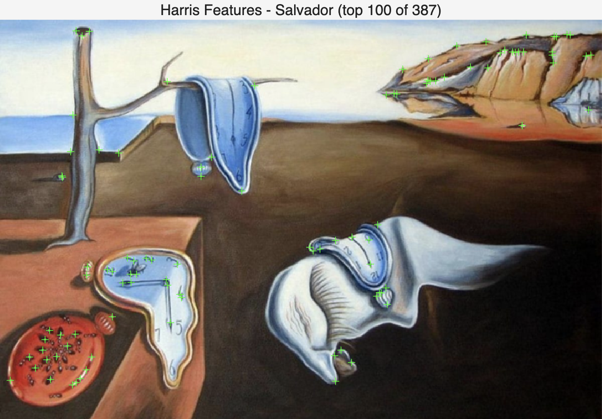

Harris detected 387 keypoints, shown as small crosses rather than circles, since Harris does not estimate feature scale. The keypoints are focused on corner-like structures — edges of the clocks, the ants, and the cliff edges. Harris is a corner detector only and does not provide scale or orientation information, making it less suitable for matching across different scales or rotations.

**Figure 6 — ORB: Salvador (top 100 of 3640)**

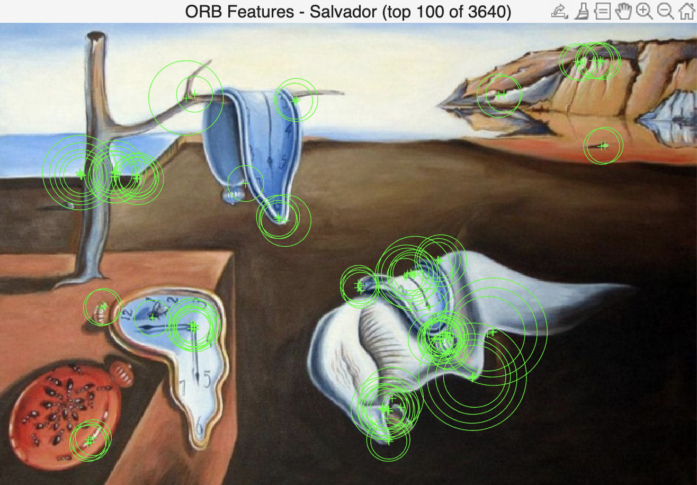

ORB detected 3640 keypoints — the most of any method tested. ORB is designed for speed and uses binary descriptors. The top 100 are distributed similarly to SIFT and SURF, focusing on the detailed and textured regions of the painting.

---

### Comparison of Methods

| Method | Points Detected | Scale Invariant | Rotation Invariant | Speed |
|--------|----------------|-----------------|-------------------|-------|
| SIFT   | 699            | ✅              | ✅                | Slow  |
| SURF   | 370            | ✅              | ✅                | Medium|
| Harris | 387            | ❌              | ❌                | Fast  |
| ORB    | 3640           | ✅              | ✅                | Fast  |

---

### Conclusion

SIFT successfully detects keypoints at semantically meaningful locations — areas with rich local structure such as the clocks, the ants, and the cliff. The `points` data structure stores location, scale, and strength for each keypoint. The Van Gogh painting produces far more keypoints than the Dalí due to its heavily textured brushstroke style. Among the methods compared, SIFT and SURF produce the most reliable and well-distributed keypoints, while Harris detects only corners without scale information, and ORB detects the most points but at the cost of descriptor quality.

---

### What I Learnt & Reflections

- SIFT detects keypoints that are invariant to scale and rotation, making them useful for matching images under different viewing conditions.
- The `Scale` field in the `points` structure determines the size of the circle drawn — larger circles indicate features detected at coarser scales, capturing larger structures.
- The number of keypoints detected depends heavily on image texture: the Van Gogh painting (8340 points) is far more textured than the Dalí painting (699 points).
- Harris is a simpler corner detector with no scale information, making it less powerful for cross-scale matching but faster and easier to interpret.
- ORB is a good choice when speed is critical, as it uses efficient binary descriptors while still being scale and rotation invariant.


