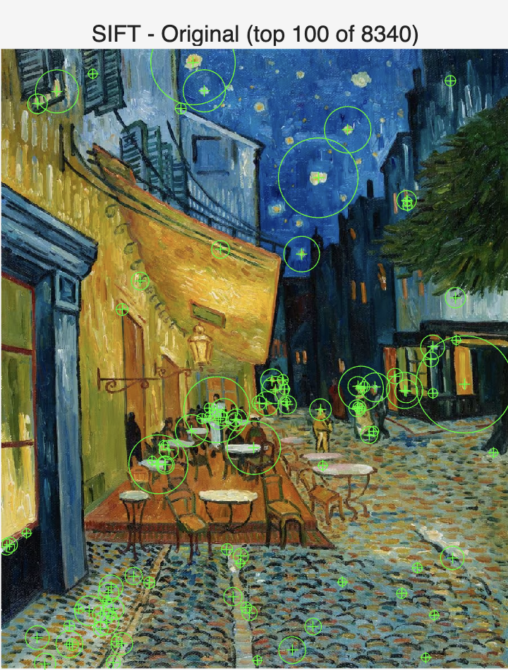
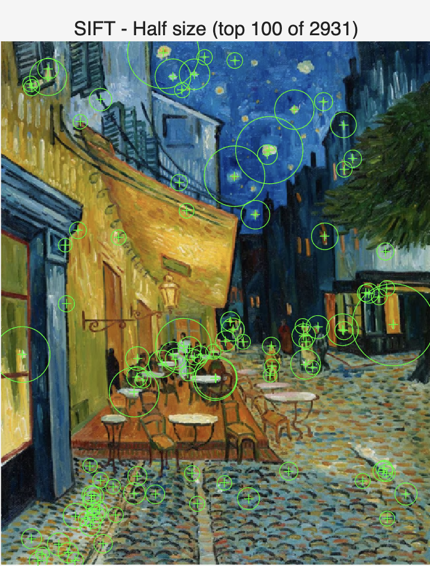
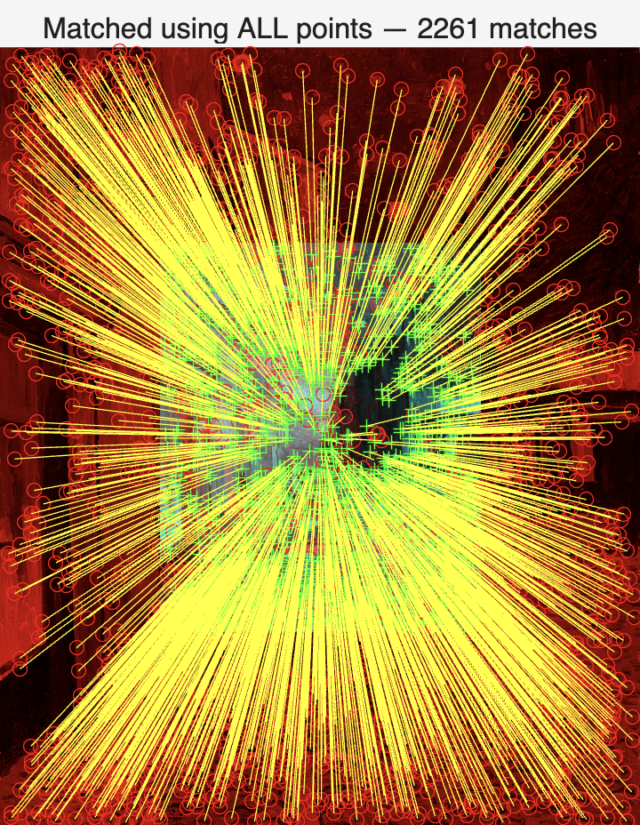
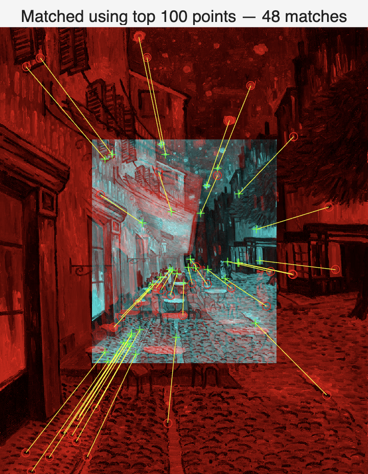
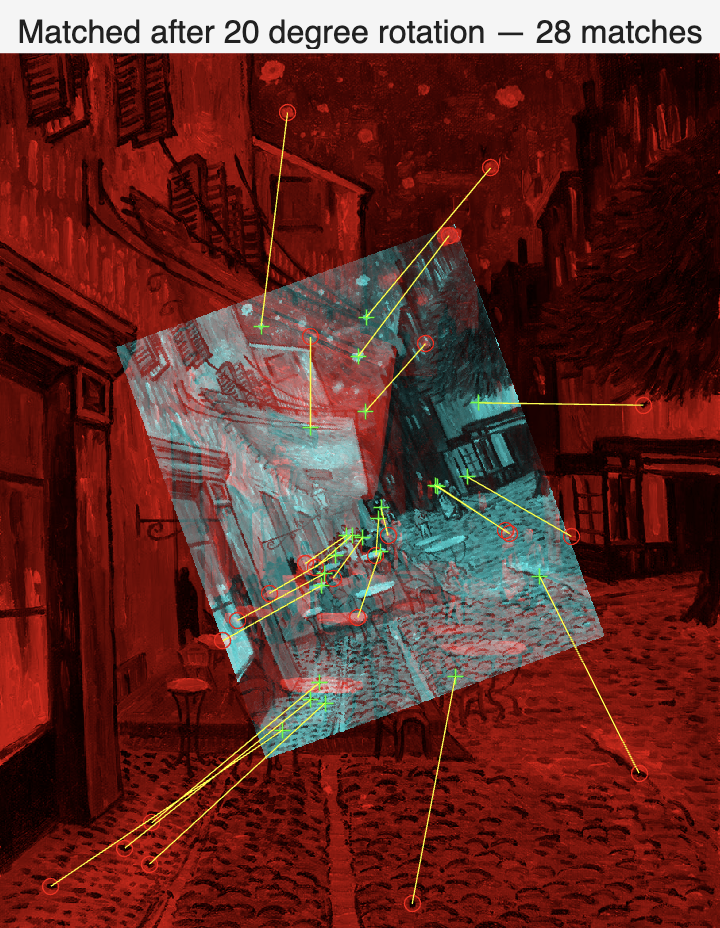
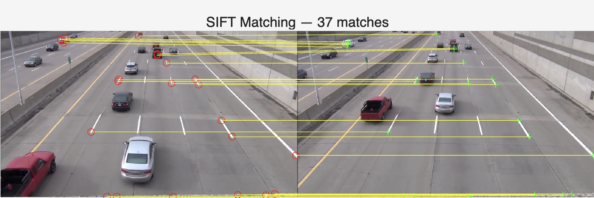
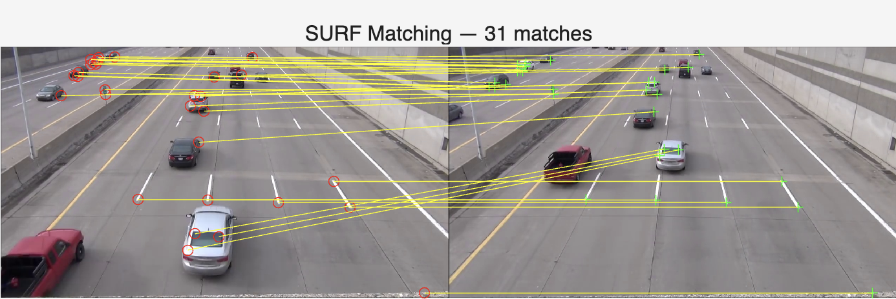
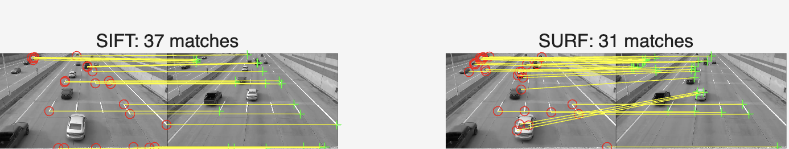

## Task 1: Image Pyramid

### Objective
Build an image pyramid of `cafe_van_gogh.jpg` at scales 1/2, 1/4, 1/8, 1/16, and 1/32 using two methods: (1) decimation by dropping every other rows/columns, and (2) resizing with `imresize`. Compare the two approaches and their visual differences.


### Code
```matlab
% Lab 6 Task 1 - Image Pyramid
clear all; close all;
f0 = imread('assets/cafe_van_gogh.jpg');

%% Method 1: Decimation by dropping every other rows and columns
f1 = f0(1:2:end, 1:2:end, :);   % 1/2
f2 = f1(1:2:end, 1:2:end, :);   % 1/4
f3 = f2(1:2:end, 1:2:end, :);   % 1/8
f4 = f3(1:2:end, 1:2:end, :);   % 1/16
f5 = f4(1:2:end, 1:2:end, :);   % 1/32

figure(1);
montage({f0, f1, f2, f3, f4, f5}, 'Size', [2 3]);
title('Method 1: Drop every other rows/columns (no pre-filter)', 'FontSize', 14);

%% Method 2: Proper resizing with imresize
f_1 = imresize(f0, 0.5);   % 1/2
f_2 = imresize(f_1, 0.5);  % 1/4
f_3 = imresize(f_2, 0.5);  % 1/8
f_4 = imresize(f_3, 0.5);  % 1/16
f_5 = imresize(f_4, 0.5);  % 1/32

figure(2);
montage({f0, f_1, f_2, f_3, f_4, f_5}, 'Size', [2 3]);
title('Method 2: imresize (lowpass filter + subsampling)', 'FontSize', 14);

%% Compare 1/8 images from both methods
figure(3); imshow(f0);  title('Original Image', 'FontSize', 14);
figure(4); imshow(f_3); title('1/8 image (imresize - filtered)', 'FontSize', 11);
figure(5); imshow(f3);  title('1/8 image (drop samples - no filter)', 'FontSize', 11);
```


### Results & Analysis

**Figure 1 — Method 1: Drop every other rows/columns (no pre-filter)**


The montage was built by repeatedly using `I(1:2:end, 1:2:end)` to halve resolution at each level. No low-pass filter is applied before subsampling. Because high-frequency details (e.g. brushstrokes, cobblestone texture) are not removed before the sampling rate is reduced, aliasing occurs — producing jagged edges, moiré patterns, and false structures in the smaller images.

**Figure 2 — Method 2: imresize (lowpass filter + subsampling)**


The montage was built by repeatedly calling `imresize(..., 0.5)`. Unlike Method 1, `imresize` applies a low-pass (Gaussian) filter before subsampling. High frequencies are removed first, so the images become progressively blurrier but remain smooth, and aliasing artefacts are largely avoided.

**Figure 3 — Original Image**


The original image provides the reference for comparing both methods.

**Figure 4 — 1/8 Scale (imresize)**


At 1/8 scale, the filtered image is blocky but smooth. Edges and textures are blurred rather than jagged, because high frequencies were removed before downsampling.

**Figure 5 — 1/8 Scale (drop samples)**


At 1/8 scale, the drop-sampling version shows clear aliasing: staircase edges, moiré-like patterns in cobblestones and other textures, and false structures. This clearly illustrates the consequence of subsampling without a pre-filter.


### Conclusion

Method 1 (drop rows/columns) is simple but causes aliasing because high frequencies are not removed before subsampling. Method 2 (`imresize`) uses a low-pass filter before subsampling, which avoids aliasing but introduces blur. For building image pyramids or any form of downsampling, pre-filtering with `imresize` is preferable to reduce artefacts. The side-by-side comparison at 1/8 scale clearly demonstrates the difference between the two approaches.


### What I Learnt & Reflections

- Subsampling without a low-pass filter leads to aliasing — visible as jaggies and moiré patterns in textured images.
- `imresize` applies Gaussian filtering before subsampling, which trades sharpness for correct representation at lower resolution.
- The `(1:2:end)` slicing syntax is a simple and efficient way to perform decimation in MATLAB, but must be paired with pre-filtering to avoid artefacts.
- This task demonstrated why the Nyquist theorem matters in practice: sampling below twice the highest frequency in the signal causes irreversible information loss and aliasing.


## Task 2: Pattern Matching with Normalized Cross Correlation

### Objective
Use MATLAB's `normxcorr2` function to perform template matching — locating a small template image within a larger image (`salvador_grayscale.tif`) by finding the position of maximum Normalized Cross Correlation (NCC) value.


### Code
```matlab
clear all; close all;

%% ===== Template 1 =====
f = imread('assets/salvador_grayscale.tif');
w = imread('assets/template1.tif');

c = normxcorr2(w, f);

figure(1);
surf(c);
shading interp;
title('NCC Surface Plot - Template 1');
xlabel('X'); ylabel('Y'); zlabel('NCC value');
colormap hot; colorbar;

[ypeak, xpeak] = find(c == max(c(:)));
yoffSet = ypeak - size(w, 1);
xoffSet = xpeak - size(w, 2);

fprintf('Template 1 found at: x=%d, y=%d\n', xoffSet, yoffSet);
fprintf('Peak NCC value: %.4f\n', max(c(:)));

figure(2);
imshow(f);
title('Template 1 Match Location');
drawrectangle(gca, 'Position', ...
    [xoffSet, yoffSet, size(w,2), size(w,1)], 'FaceAlpha', 0);

%% ===== Template 2 =====
w2 = imread('assets/template2.tif');

c2 = normxcorr2(w2, f);

figure(3);
surf(c2);
shading interp;
title('NCC Surface Plot - Template 2');
xlabel('X'); ylabel('Y'); zlabel('NCC value');
colormap hot; colorbar;

[ypeak2, xpeak2] = find(c2 == max(c2(:)));
yoffSet2 = ypeak2 - size(w2, 1);
xoffSet2 = xpeak2 - size(w2, 2);

fprintf('Template 2 found at: x=%d, y=%d\n', xoffSet2, yoffSet2);
fprintf('Peak NCC value: %.4f\n', max(c2(:)));

figure(4);
imshow(f);
title('Template 2 Match Location');
drawrectangle(gca, 'Position', ...
    [xoffSet2, yoffSet2, size(w2,2), size(w2,1)], 'FaceAlpha', 0);
```


### Results & Analysis

**Figure 1 — NCC Surface Plot: Template 1**


The NCC surface for Template 1 shows a relatively flat landscape with many moderate peaks across the image. There is no single sharp dominant spike, which suggests Template 1 contains features (such as texture or tone) that partially match many regions of the image. However, `find(c == max(c(:)))` correctly identifies the global maximum, which corresponds to the true match location.

**Figure 2 — Template 1 Match Location**


The blue dashed rectangle is drawn at the position of the peak NCC value. It correctly locates a small region on the left side of the painting, near the melting clock — confirming that Template 1 was extracted from that area of the image.

**Figure 3 — NCC Surface Plot: Template 2**


The NCC surface for Template 2 shows a much more prominent and isolated spike — a single tall peak that stands clearly above the rest of the surface. This indicates that Template 2 contains more distinctive features that match strongly at only one location in the image, making the peak easier to identify visually.

**Figure 4 — Template 2 Match Location**


The blue dashed rectangle correctly locates Template 2 on the right side of the painting, within the melting clock draped over the face-like figure. The match is precise and unambiguous.


### About `find()`

The MATLAB function `find()` returns the indices of non-zero elements in an array. In this context:
```matlab
[ypeak, xpeak] = find(c == max(c(:)));
```

`max(c(:))` flattens the NCC matrix and finds the maximum value. `find(c == max(c(:)))` then returns the row and column indices where that maximum value occurs — i.e. the (y, x) location of the best match. The offset calculation (`ypeak - size(w,1)`) converts from NCC output coordinates back to the original image coordinates.


### Conclusion

`normxcorr2` successfully located both templates within the painting. Template 2 produced a sharper and more isolated NCC peak than Template 1, suggesting it contains more distinctive local features. This demonstrates a key property of NCC-based template matching: it works best when the template has unique features that do not appear elsewhere in the image. NCC can only match a template if the match is exact or nearly exact — changes in scale, rotation, or illumination would cause the peak to drop significantly.


### What I Learnt & Reflections

- `normxcorr2` computes a normalised similarity score at every possible position of the template within the image — a score of 1.0 means a perfect match.
- The shape of the NCC surface reveals how distinctive the template is: a sharp isolated peak means a unique match; a flat noisy surface means many similar regions exist.
- `find()` is used to convert the peak location in the NCC output back to image coordinates, with an offset correction for the template size.
- NCC is sensitive to exact pixel matches — it would fail if the template were scaled, rotated, or had different lighting. More robust methods (e.g. SIFT, SURF) are needed for such cases.


## Task 3: SIFT Feature Detection

### Objective
Apply SIFT feature detection to two paintings — `salvador.jpg` and `cafe_van_gogh.jpg` — and explore the `points` data structure. Additionally, compare SIFT with other feature detection methods available in MATLAB: SURF, Harris, and ORB.


### Code
```matlab
clear all; close all;

%% ===== Salvador Dali =====
I1 = imread('assets/salvador.jpg');
f1 = im2gray(I1);

points1 = detectSIFTFeatures(f1);

figure(1);
imshow(I1); hold on;
plot(points1.selectStrongest(100));
title(sprintf('SIFT Features - Salvador (top 100 of %d)', points1.Count));

fprintf('=== points data structure ===\n');
fprintf('Total SIFT points detected: %d\n', points1.Count);
fprintf('First point Location: (%.1f, %.1f)\n', points1.Location(1,1), points1.Location(1,2));
fprintf('First point Scale: %.4f\n', points1.Scale(1));
fprintf('First point Metric (strength): %.4f\n', points1.Metric(1));

figure(2);
imshow(I1); hold on;
plot(points1);
title(sprintf('SIFT Features - Salvador (all %d points)', points1.Count));

%% ===== Cafe Van Gogh =====
I2 = imread('assets/cafe_van_gogh.jpg');
f2 = im2gray(I2);

points2 = detectSIFTFeatures(f2);

figure(3);
imshow(I2); hold on;
plot(points2.selectStrongest(100));
title(sprintf('SIFT Features - Cafe Van Gogh (top 100 of %d)', points2.Count));

%% ===== Other feature detection methods =====
pointsSURF = detectSURFFeatures(f1);
figure(4);
imshow(I1); hold on;
plot(pointsSURF.selectStrongest(100));
title(sprintf('SURF Features - Salvador (top 100 of %d)', pointsSURF.Count));

pointsHarris = detectHarrisFeatures(f1);
figure(5);
imshow(I1); hold on;
plot(pointsHarris.selectStrongest(100));
title(sprintf('Harris Features - Salvador (top 100 of %d)', pointsHarris.Count));

pointsORB = detectORBFeatures(f1);
figure(6);
imshow(I1); hold on;
plot(pointsORB.selectStrongest(100));
title(sprintf('ORB Features - Salvador (top 100 of %d)', pointsORB.Count));
```


### The `points` Data Structure

The variable `points` returned by `detectSIFTFeatures` is a `SIFTPoints` object containing the following key fields:

- **`Location`** — (x, y) coordinates of each detected keypoint in the image
- **`Scale`** — the scale at which the feature was detected, determining the size of the circle drawn around it
- **`Metric`** — a strength score indicating how distinctive the keypoint is; higher values indicate stronger, more reliable features
- **`Count`** — total number of keypoints detected
- **`selectStrongest(N)`** — a method that returns the N keypoints with the highest Metric values


### Results & Analysis

**Figure 1 — SIFT: Salvador (top 100 of 699)**


699 SIFT keypoints were detected in total. The top 100 strongest are shown as green circles, where the circle size reflects the feature scale. Keypoints are concentrated around high-detail regions — the melting clocks, the face-like figure, the ants, and the rocky cliff — which are areas with rich local texture and strong intensity gradients. Flat, uniform areas such as the sky and the dark background contain few or no keypoints.

**Figure 2 — SIFT: Salvador (all 699 points)**


Displaying all 699 points shows that keypoints are distributed across every detailed region of the painting. The density is highest in the clocks and the face-like figure where fine detail is richest. The variety of circle sizes shows that SIFT detects features at multiple scales simultaneously.

**Figure 3 — SIFT: Cafe Van Gogh (top 100 of 8340)**


The Van Gogh painting produced 8340 SIFT keypoints — significantly more than the Dalí painting. This is because Van Gogh's brushstroke style creates highly textured surfaces across the entire image, generating a much larger number of local feature candidates. The top 100 keypoints are spread across the cobblestones, café furniture, stars, and building edges.

**Figure 4 — SURF: Salvador (top 100 of 370)**


SURF detected 370 keypoints, fewer than SIFT (699). The distribution is similar — concentrated around the clocks and the detailed figure — but the circles tend to be larger, reflecting SURF's use of box filters at coarser scales. SURF is generally faster than SIFT but slightly less precise.

**Figure 5 — Harris: Salvador (top 100 of 387)**


Harris detected 387 keypoints, shown as small crosses rather than circles, since Harris does not estimate feature scale. The keypoints are focused on corner-like structures — edges of the clocks, the ants, and the cliff edges. Harris is a corner detector only and does not provide scale or orientation information, making it less suitable for matching across different scales or rotations.

**Figure 6 — ORB: Salvador (top 100 of 3640)**


ORB detected 3640 keypoints — the most of any method tested. ORB is designed for speed and uses binary descriptors. The top 100 are distributed similarly to SIFT and SURF, focusing on the detailed and textured regions of the painting.


### Comparison of Methods

| Method | Points Detected | Scale Invariant | Rotation Invariant | Speed |
|--------|----------------|-----------------|-------------------|-------|
| SIFT   | 699            | ✅              | ✅                | Slow  |
| SURF   | 370            | ✅              | ✅                | Medium|
| Harris | 387            | ❌              | ❌                | Fast  |
| ORB    | 3640           | ✅              | ✅                | Fast  |


### Conclusion

SIFT successfully detects keypoints at semantically meaningful locations — areas with rich local structure such as the clocks, the ants, and the cliff. The `points` data structure stores location, scale, and strength for each keypoint. The Van Gogh painting produces far more keypoints than the Dalí due to its heavily textured brushstroke style. Among the methods compared, SIFT and SURF produce the most reliable and well-distributed keypoints, while Harris detects only corners without scale information, and ORB detects the most points but at the cost of descriptor quality.


### What I Learnt & Reflections

- SIFT detects keypoints that are invariant to scale and rotation, making them useful for matching images under different viewing conditions.
- The `Scale` field in the `points` structure determines the size of the circle drawn — larger circles indicate features detected at coarser scales, capturing larger structures.
- The number of keypoints detected depends heavily on image texture: the Van Gogh painting (8340 points) is far more textured than the Dalí painting (699 points).
- Harris is a simpler corner detector with no scale information, making it less powerful for cross-scale matching but faster and easier to interpret.
- ORB is a good choice when speed is critical, as it uses efficient binary descriptors while still being scale and rotation invariant.

## Task 4: SIFT Matching Across Scales

### Objective
Use SIFT feature detection on two versions of the same image at different scales — the original `cafe_van_gogh.jpg` and a half-size version — to evaluate how well SIFT detects consistent features across different resolutions.


### Code
```matlab
clear all; close all;
I1 = imread('assets/cafe_van_gogh.jpg');
I2 = imresize(I1, 0.5);
f1 = im2gray(I1);
f2 = im2gray(I2);
points1 = detectSIFTFeatures(f1);
points2 = detectSIFTFeatures(f2);
Nbest = 100;
bestFeatures1 = points1.selectStrongest(Nbest);
bestFeatures2 = points2.selectStrongest(Nbest);
figure(1); imshow(I1);
hold on;
plot(bestFeatures1);
title(sprintf('SIFT - Original (top 100 of %d)', points1.Count));
hold off;
figure(2); imshow(I2);
hold on;
plot(bestFeatures2);
title(sprintf('SIFT - Half size (top 100 of %d)', points2.Count));
hold off;
```


### Results & Analysis

**Figure 1 — SIFT: Original Image (top 100 of 8340)**



The original image produced 8340 SIFT keypoints in total. The top 100 strongest are distributed across the most distinctive regions — the glowing stars in the night sky, the café terrace furniture, the cobblestones, and the building edges. Circle sizes vary considerably, reflecting features detected at multiple scales.

**Figure 2 — SIFT: Half-Size Image (top 100 of 2931)**



The half-size image produced 2931 keypoints — significantly fewer than the original (8340). This is expected because downsampling reduces fine detail, making many small-scale features undetectable. However, the top 100 strongest keypoints are located in the **same semantic regions** as the original — the stars, the café tables and chairs, the cobblestones, and the building facades.


### Conclusions

Comparing the two figures, the spatial distribution of the top 100 features is remarkably consistent between the original and half-size images. Key observations:

- The **same prominent regions** attract the strongest keypoints in both images — stars, furniture, building edges — demonstrating SIFT's scale invariance in practice.
- The **total number of keypoints drops** from 8340 to 2931 at half resolution, because fine-grained texture details that were detectable at full resolution are lost after downsampling.
- The **circle sizes in Figure 2 are relatively larger** compared to Figure 1, because SIFT adapts its detection scale to the image resolution — the same physical feature occupies fewer pixels in the smaller image, so it is captured at a coarser scale level.
- SIFT is considered **scale-invariant** because it builds a scale-space pyramid and detects features at the scale where they are most stable. This allows it to find corresponding features across images of different sizes.


### What I Learnt & Reflections

- SIFT detects features at the scale where they are most distinctive, making it robust to changes in image size — this is its key advantage over simpler detectors like Harris.
- Reducing image size reduces the total number of detectable features, but the strongest and most distinctive features survive across scales.
- The consistency of keypoint locations between the two images confirms that SIFT's scale-space approach successfully identifies the same physical structures regardless of resolution.
- In real applications such as image stitching or object recognition, this scale invariance means SIFT can match features between a close-up and a distant view of the same scene.


## Task 4 (continued): SIFT Matching — Scale and Rotation Invariance

### Objective
Match SIFT features between the original and half-size versions of `cafe_van_gogh.jpg` using all points and top 100 points, then verify SIFT's rotation invariance by rotating the smaller image by 20 degrees before matching.


### Code
```matlab
clear all; close all;

I1 = imread('assets/cafe_van_gogh.jpg');
I2 = imresize(I1, 0.5);
f1 = im2gray(I1);
f2 = im2gray(I2);

points1 = detectSIFTFeatures(f1);
points2 = detectSIFTFeatures(f2);

Nbest = 100;
bestFeatures1 = points1.selectStrongest(Nbest);
bestFeatures2 = points2.selectStrongest(Nbest);

%% Part 1: Match using ALL points
[features1, valid_points1] = extractFeatures(f1, points1);
[features2, valid_points2] = extractFeatures(f2, points2);

indexPairs = matchFeatures(features1, features2, 'Unique', true);
matchedPoints1 = valid_points1(indexPairs(:,1),:);
matchedPoints2 = valid_points2(indexPairs(:,2),:);

figure(1);
showMatchedFeatures(f1, f2, matchedPoints1, matchedPoints2);
title(sprintf('Matched using ALL points — %d matches', size(indexPairs,1)));

%% Part 2: Match using top 100 only
[features1, valid_points1] = extractFeatures(f1, bestFeatures1);
[features2, valid_points2] = extractFeatures(f2, points2.selectStrongest(Nbest));

indexPairs2 = matchFeatures(features1, features2, 'Unique', true);
matchedPoints1b = valid_points1(indexPairs2(:,1),:);
matchedPoints2b = valid_points2(indexPairs2(:,2),:);

figure(2);
showMatchedFeatures(f1, f2, matchedPoints1b, matchedPoints2b);
title(sprintf('Matched using top 100 points — %d matches', size(indexPairs2,1)));

%% Part 3: Rotate smaller image by 20 degrees
I2_rot = imrotate(I2, 20);
f2_rot = im2gray(I2_rot);

points2_rot = detectSIFTFeatures(f2_rot);

[features1r, valid_points1r] = extractFeatures(f1, bestFeatures1);
[features2r, valid_points2r] = extractFeatures(f2_rot, points2_rot.selectStrongest(Nbest));

indexPairs3 = matchFeatures(features1r, features2r, 'Unique', true);
matchedPoints1r = valid_points1r(indexPairs3(:,1),:);
matchedPoints2r = valid_points2r(indexPairs3(:,2),:);

figure(3);
showMatchedFeatures(f1, f2_rot, matchedPoints1r, matchedPoints2r);
title(sprintf('Matched after 20 degree rotation — %d matches', size(indexPairs3,1)));
```


### Results & Analysis

**Figure 1 — Matched using ALL points (2261 matches)**



Using all detected SIFT points produced 2261 matches. However, the result is clearly overcrowded — the match lines radiate in all directions and many are clearly incorrect (false matches), as lines cross each other randomly rather than forming a consistent geometric pattern. This is because with thousands of points, many features in one image find a numerically close but geometrically wrong match in the other image.

**Figure 2 — Matched using top 100 points (48 matches)**



Restricting matching to the top 100 strongest points reduced the matches to 48, but the quality improved significantly. The match lines are more consistent and directional — most lines point from the corresponding region in the original image to the correct scaled position in the half-size image. The smaller image (shown as the cyan overlay) is correctly positioned within the original, confirming that the strongest SIFT features are reliably matched across scales.

**Figure 3 — Matched after 20 degree rotation (28 matches)**



After rotating the smaller image by 20 degrees, SIFT still produced 28 correct matches. The rotated image (cyan overlay) is clearly tilted relative to the original, yet the match lines still correctly connect corresponding regions between the two images. This demonstrates that SIFT is **rotation invariant** — it assigns a dominant orientation to each keypoint based on local gradient directions, allowing it to match features regardless of the image orientation.


### Conclusion

These three experiments demonstrate two key properties of SIFT:

- **Scale invariance**: SIFT successfully matches features between the original and half-size image, even though all pixel coordinates and feature scales differ by a factor of 2.
- **Rotation invariance**: SIFT successfully matches features between the original and a 20-degree rotated version of the image, with 28 correct matches found.

Using all points produces too many false matches due to ambiguity. Selecting only the strongest features improves match quality significantly, as these points are more distinctive and less likely to produce false positives.


### What I Learnt & Reflections

- Using all SIFT points for matching produces many false matches — restricting to the strongest features gives cleaner and more reliable results.
- SIFT assigns each keypoint a dominant orientation from the local gradient histogram, making it invariant to rotation — this is confirmed by the successful matching after a 20 degree rotation.
- The number of correct matches decreases after rotation (48 → 28), which is expected since some features near the image boundary are cropped out by `imrotate`, reducing the number of candidates.
- In real applications like panorama stitching or object recognition, SIFT's combined scale and rotation invariance makes it one of the most robust feature detectors available.

## Task 5: SIFT vs SURF Feature Matching on Traffic Video Frames

### Objective
Apply SIFT and SURF feature matching to two consecutive frames of a motorway traffic video (`traffic_1.jpg` and `traffic_2.jpg`), compare the number and quality of matches, and evaluate each method's suitability for object tracking between video frames.


### Code
```matlab
clear all; close all;

I1 = imread('assets/traffic_1.jpg');
I2 = imread('assets/traffic_2.jpg');
f1 = im2gray(I1);
f2 = im2gray(I2);

Nbest = 100;

%% SIFT Matching
points1_sift = detectSIFTFeatures(f1);
points2_sift = detectSIFTFeatures(f2);

best1_sift = points1_sift.selectStrongest(Nbest);
best2_sift = points2_sift.selectStrongest(Nbest);

[feat1_sift, vp1_sift] = extractFeatures(f1, best1_sift);
[feat2_sift, vp2_sift] = extractFeatures(f2, best2_sift);

pairs_sift = matchFeatures(feat1_sift, feat2_sift, 'Unique', true);
mp1_sift = vp1_sift(pairs_sift(:,1),:);
mp2_sift = vp2_sift(pairs_sift(:,2),:);

fprintf('SIFT matches: %d\n', size(pairs_sift,1));

figure(1);
showMatchedFeatures(I1, I2, mp1_sift, mp2_sift, 'montage');
title(sprintf('SIFT Matching — %d matches', size(pairs_sift,1)));

%% SURF Matching
points1_surf = detectSURFFeatures(f1);
points2_surf = detectSURFFeatures(f2);

best1_surf = points1_surf.selectStrongest(Nbest);
best2_surf = points2_surf.selectStrongest(Nbest);

[feat1_surf, vp1_surf] = extractFeatures(f1, best1_surf);
[feat2_surf, vp2_surf] = extractFeatures(f2, best2_surf);

pairs_surf = matchFeatures(feat1_surf, feat2_surf, 'Unique', true);
mp1_surf = vp1_surf(pairs_surf(:,1),:);
mp2_surf = vp2_surf(pairs_surf(:,2),:);

fprintf('SURF matches: %d\n', size(pairs_surf,1));

figure(2);
showMatchedFeatures(I1, I2, mp1_surf, mp2_surf, 'montage');
title(sprintf('SURF Matching — %d matches', size(pairs_surf,1)));

%% Side by side comparison
figure(3);
subplot(1,2,1);
showMatchedFeatures(f1, f2, mp1_sift, mp2_sift, 'montage');
title(sprintf('SIFT: %d matches', size(pairs_sift,1)));
subplot(1,2,2);
showMatchedFeatures(f1, f2, mp1_surf, mp2_surf, 'montage');
title(sprintf('SURF: %d matches', size(pairs_surf,1)));
```


### Results & Analysis

**Figure 1 — SIFT Matching (37 matches)**



SIFT produced 37 matches between the two traffic frames. The match lines are mostly horizontal, which makes physical sense — cars on a motorway move primarily in a horizontal direction between consecutive frames. Most matches correctly link the same static features in both frames, such as road markings, lane lines, and the concrete barrier. Some matches also correctly track moving cars that have shifted slightly between frames. A small number of lines cross each other, suggesting a few false matches.

**Figure 2 — SURF Matching (31 matches)**



SURF produced 31 matches — slightly fewer than SIFT. The overall pattern is similar, with mostly horizontal match lines connecting road markings and static background features. However, SURF appears to cluster more matches around the cars and the top section of the frame, with fewer matches on the road surface compared to SIFT.

**Figure 3 — SIFT vs SURF Side-by-Side Comparison**



The side-by-side comparison confirms that both methods produce geometrically consistent matches — the predominantly horizontal match lines reflect the direction of car movement between frames. SIFT found slightly more matches (37 vs 31), and the matches appear more evenly distributed across the image. Both methods successfully perform basic object tracking between the two video frames.


### Conclusion

Both SIFT and SURF successfully matched features between two consecutive traffic video frames, effectively tracking both static background features (road markings, barriers) and moving objects (cars). SIFT produced more matches (37 vs 31) and a more spatially even distribution. The predominantly horizontal match lines are consistent with the expected direction of car movement on a motorway. This demonstrates that feature matching can be used as a basis for object tracking in video sequences — by identifying which features in one frame correspond to features in the next.


### What I Learnt & Reflections

- Both SIFT and SURF can be applied to video frame matching for object tracking, not just static image comparison.
- The direction of match lines reflects the actual motion of objects — horizontal lines confirm cars are moving laterally between frames.
- SIFT found slightly more matches than SURF in this case, though both methods produced comparable quality results.
- Static background features (road markings, barriers) generate the most reliable matches, while moving cars produce fewer matches due to their positional shift between frames.
- For real-time video tracking, SURF's speed advantage over SIFT would become more important, even though it found slightly fewer matches here.


